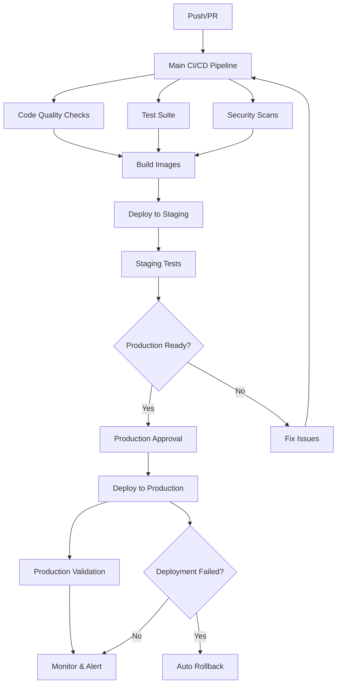

# 🚀 AI Finance Agency CI/CD Pipeline

## Overview

This repository contains a comprehensive, production-ready CI/CD pipeline built with GitHub Actions for the AI Finance Agency platform. The pipeline orchestrates everything from code quality checks to zero-downtime deployments across multiple microservices.

## 📋 Table of Contents

- [🏗️ Pipeline Architecture](#️-pipeline-architecture)
- [🔄 Workflows](#-workflows)
- [🎯 Deployment Strategies](#-deployment-strategies)
- [🧪 Testing Strategy](#-testing-strategy)
- [🔍 Quality Gates](#-quality-gates)
- [📊 Monitoring & Observability](#-monitoring--observability)
- [🚨 Emergency Procedures](#-emergency-procedures)
- [⚙️ Configuration](#️-configuration)
- [🔧 Setup Instructions](#-setup-instructions)
- [🛠️ Troubleshooting](#️-troubleshooting)

## 🏗️ Pipeline Architecture



## 🔄 Workflows

### 1. Main CI/CD Pipeline (`ci-cd-main.yml`)
**Trigger**: Push to main/develop, Pull Requests  
**Purpose**: Orchestrates the entire CI/CD process

**Stages**:
- 🔍 **Preparation & Validation**: Detect changes, generate versions
- 🔍 **Code Quality**: Parallel linting, formatting, type checking
- 🧪 **Test Suite**: Unit, integration, E2E tests
- 🔒 **Security Scan**: Vulnerability scanning with Trivy & Snyk
- 🏗️ **Build Images**: Multi-arch Docker builds with caching
- 🚀 **Deploy Staging**: Automated staging deployment
- 🚀 **Deploy Production**: Manual approval required for production
- 🧪 **Smoke Tests**: Post-deployment validation
- 📢 **Notifications**: Slack/Discord alerts

### 2. Testing Workflow (`test.yml`)
**Trigger**: Called by main pipeline or manual dispatch  
**Purpose**: Comprehensive testing across multiple services

**Test Types**:
- **Unit Tests**: Node.js (18, 20, 22) & Python (3.10, 3.11, 3.12) matrix
- **Integration Tests**: With PostgreSQL, Redis, MongoDB services
- **E2E Tests**: Playwright across Chromium, Firefox, WebKit
- **Performance Tests**: Artillery load testing scenarios
- **Security Tests**: OWASP ZAP & Nuclei scans

### 3. Code Quality (`code-quality.yml`)
**Trigger**: Part of main pipeline or standalone  
**Purpose**: Enforce code standards and quality gates

**Checks**:
- **JavaScript/TypeScript**: ESLint with JSON reports
- **Python**: Flake8, Black, isort, MyPy
- **Formatting**: Prettier & Black with auto-fix for PRs
- **Type Checking**: TypeScript compiler validation
- **Dependencies**: npm audit, Snyk, dependency review
- **Complexity**: Code complexity analysis
- **Documentation**: JSDoc, docstrings, markdown linting

### 4. Staging Deployment (`deploy-staging.yml`)
**Trigger**: Successful main pipeline or manual dispatch  
**Purpose**: Blue-green deployment to staging environment

**Process**:
- 🔍 **Pre-deployment Validation**: Health checks, image verification
- 🗄️ **Database Migration**: Automated schema updates
- 🔵 **Blue-Green Deploy**: Zero-downtime deployment strategy
- 🧪 **Post-deployment Tests**: Smoke, integration, performance
- 📊 **Monitoring Setup**: Update dashboards and alerts
- 📢 **Notifications**: Success/failure alerts with rollback triggers

### 5. Production Deployment (`deploy-production.yml`)
**Trigger**: Manual approval or main branch push  
**Purpose**: Production deployment with multiple safety measures

**Process**:
- 🛡️ **Production Readiness Gate**: Multi-step approval process
- 💾 **Pre-deployment Backup**: Database and configuration backup
- 🚧 **Maintenance Mode**: Optional user-facing maintenance page
- 🚀 **Blue-Green/Canary Deploy**: Configurable deployment strategies
- 🧪 **Production Smoke Tests**: Critical path validation
- 📊 **Enhanced Monitoring**: 24-hour enhanced alerting
- 📢 **Team Notifications**: Multiple channels (Slack, email)

### 6. Emergency Rollback (`rollback.yml`)
**Trigger**: Manual dispatch or automatic on failure  
**Purpose**: Emergency rollback capabilities

**Rollback Types**:
- **Immediate**: Parallel rollback of all services
- **Gradual**: Batch rollback with health checks between batches
- **Partial**: Rollback only unhealthy services

## 🎯 Deployment Strategies

### Blue-Green Deployment (Default)
```yaml
# Zero-downtime deployment
1. Deploy new version (green) alongside current (blue)
2. Run health checks on green deployment
3. Switch traffic from blue to green
4. Monitor for issues
5. Remove blue deployment after verification
```

### Canary Deployment
```yaml
# Gradual traffic shifting
1. Deploy canary version with minimal traffic (10%)
2. Monitor metrics and health
3. Gradually increase traffic percentage
4. Full rollout or rollback based on metrics
```

### Rolling Deployment
```yaml
# Traditional rolling update
1. Replace instances one by one
2. Wait for health check before next instance
3. Continue until all instances updated
```

## 🧪 Testing Strategy

### Test Pyramid Implementation
```
    🔺 E2E Tests (Playwright)
     - Cross-browser testing
     - User journey validation
     - API integration tests
   
   🔺🔺 Integration Tests
     - Service-to-service communication
     - Database interactions
     - External API mocking
   
  🔺🔺🔺 Unit Tests
    - Component isolation
    - Business logic validation
    - High coverage requirements
```

### Test Environment Matrix
| Test Type | Node.js Versions | Python Versions | Browsers | Databases |
|-----------|------------------|-----------------|----------|-----------|
| Unit      | 18, 20, 22      | 3.10, 3.11, 3.12| N/A     | Mocked    |
| Integration| 20              | 3.11           | N/A      | Real      |
| E2E       | 20              | N/A            | Chrome, FF, WebKit | Real |

## 🔍 Quality Gates

### Mandatory Gates (Block Deployment)
- ✅ All unit tests must pass
- ✅ Integration tests must pass
- ✅ Type checking must pass
- ✅ No critical security vulnerabilities
- ✅ Code coverage above threshold (80%)

### Advisory Gates (Generate Warnings)
- ⚠️ Code formatting issues (auto-fixed in PRs)
- ⚠️ Documentation coverage
- ⚠️ Code complexity warnings
- ⚠️ Medium security vulnerabilities

### Production Gates (Additional)
- 🛡️ Staging deployment must be successful
- 🛡️ Manual approval from 2+ team members
- 🛡️ No critical alerts in last 24 hours
- 🛡️ Database backup completed

## 📊 Monitoring & Observability

### Metrics Collection
- **Application Metrics**: Custom business metrics via Prometheus
- **Infrastructure Metrics**: Container, host, and network metrics
- **Performance Metrics**: Response times, throughput, error rates
- **Business Metrics**: User actions, revenue, conversion rates

### Alerting Rules
```yaml
Critical Alerts (PagerDuty):
  - Service down for >2 minutes
  - Error rate >5% for >5 minutes
  - Response time >2s for >10 minutes
  - Database connection failures

Warning Alerts (Slack):
  - High memory usage (>80%)
  - Disk space low (<15%)
  - Unusual traffic patterns
  - Failed background jobs
```

### Dashboards
- **Deployment Dashboard**: Real-time deployment status
- **Service Health Dashboard**: All microservices health
- **Business Metrics Dashboard**: KPIs and conversion rates
- **Infrastructure Dashboard**: Resource utilization

## 🚨 Emergency Procedures

### Automatic Rollback Triggers
- Deployment failure during production deploy
- Critical health check failures post-deployment
- Error rate spike >10% within 5 minutes
- Complete service unavailability

### Manual Rollback Process
```bash
# Emergency rollback to previous version
gh workflow run rollback.yml \
  --field environment=production \
  --field rollback_type=immediate \
  --field reason="Critical production issue"
```

### Incident Response
1. **Detection**: Automated alerts or manual discovery
2. **Assessment**: Determine impact and root cause
3. **Response**: Rollback, hotfix, or mitigation
4. **Communication**: Update status page and notify users
5. **Post-mortem**: Document lessons learned

## ⚙️ Configuration

### Required Secrets
```yaml
# GitHub Repository Secrets
GITHUB_TOKEN: # GitHub token for actions
SLACK_WEBHOOK_URL: # Slack notifications
SNYK_TOKEN: # Security scanning

# Environment URLs
STAGING_BASE_URL: # https://staging.ai-finance.com
PRODUCTION_BASE_URL: # https://api.ai-finance.com

# Kubernetes Configuration
KUBE_CONFIG_STAGING: # Base64 encoded kubeconfig
KUBE_CONFIG_PRODUCTION: # Base64 encoded kubeconfig

# Database Credentials
DATABASE_URL: # Production database connection
REDIS_URL: # Redis connection string
MONGODB_URL: # MongoDB connection string

# API Keys
CLAUDE_API_KEY: # AI service integration
OPENAI_API_KEY: # AI service integration
STRIPE_SECRET_KEY: # Payment processing

# Notification Channels
OPS_TEAM_EMAIL: # Emergency notifications
PRODUCTION_APPROVERS: # Deployment approvers
```

### Environment Variables
```bash
# Deployment Configuration
NODE_VERSION=20
PYTHON_VERSION=3.11
DOCKER_BUILDKIT=1
COMPOSE_DOCKER_CLI_BUILD=1

# Quality Gates
COVERAGE_THRESHOLD=80
MAX_COMPLEXITY=10
SECURITY_THRESHOLD=medium

# Deployment Timeouts
DEPLOYMENT_TIMEOUT=1800
ROLLBACK_TIMEOUT=900
HEALTH_CHECK_TIMEOUT=300
```

## 🔧 Setup Instructions

### 1. Initial Repository Setup
```bash
# Clone repository
git clone https://github.com/your-org/ai-finance-agency.git
cd ai-finance-agency

# Install dependencies
npm install

# Set up pre-commit hooks
npm run prepare
```

### 2. Configure Secrets
```bash
# Add all required secrets to GitHub repository settings
# Settings > Secrets and Variables > Actions
```

### 3. Environment Setup
```bash
# Create environment files
cp .env.example .env.staging
cp .env.example .env.production

# Configure environment-specific values
vim .env.staging
vim .env.production
```

### 4. Kubernetes Setup (if using K8s)
```bash
# Apply base configurations
kubectl apply -f infrastructure/k8s/base/

# Apply environment-specific configs
kubectl apply -f infrastructure/k8s/staging/
kubectl apply -f infrastructure/k8s/production/
```

### 5. First Deployment
```bash
# Trigger initial deployment
git push origin main

# Or trigger manually
gh workflow run ci-cd-main.yml --ref main
```

## 🛠️ Troubleshooting

### Common Issues

#### 1. Build Failures
```bash
# Check build logs
gh run list --workflow=ci-cd-main.yml
gh run view <run-id>

# Local debugging
docker build -t test-build .
docker run --rm test-build npm test
```

#### 2. Test Failures
```bash
# Run tests locally
npm run test:unit
npm run test:integration
npm run test:e2e

# Debug specific service
cd services/api-gateway
npm test -- --verbose
```

#### 3. Deployment Issues
```bash
# Check deployment status
kubectl get deployments -n ai-finance-production
kubectl get pods -n ai-finance-production

# Check service logs
kubectl logs -f deployment/api-gateway -n ai-finance-production
```

#### 4. Health Check Failures
```bash
# Manual health check
curl -f https://api.ai-finance.com/health
curl -f https://api.ai-finance.com/api/v1/status

# Check service dependencies
curl -f https://api.ai-finance.com/api/v1/dependencies
```

### Debugging Workflows

#### View Workflow Logs
```bash
# List recent runs
gh run list

# View specific run
gh run view <run-id>

# Download logs
gh run download <run-id>
```

#### Debug Failed Steps
```bash
# Re-run failed jobs
gh run rerun <run-id> --failed

# View job details
gh api repos/:owner/:repo/actions/runs/<run-id>/jobs
```

### Performance Optimization

#### Build Cache Optimization
```yaml
# Docker build cache
- uses: docker/build-push-action@v5
  with:
    cache-from: type=gha
    cache-to: type=gha,mode=max
```

#### Test Parallelization
```yaml
# Matrix strategy for parallel testing
strategy:
  matrix:
    service: [api-gateway, payment, signals, trading]
    node-version: [18, 20, 22]
  max-parallel: 4
```

## 📚 Additional Resources

- [GitHub Actions Documentation](https://docs.github.com/en/actions)
- [Docker Best Practices](https://docs.docker.com/develop/dev-best-practices/)
- [Kubernetes Deployment Strategies](https://kubernetes.io/docs/concepts/workloads/controllers/deployment/)
- [Prometheus Monitoring](https://prometheus.io/docs/introduction/overview/)
- [Security Scanning with Trivy](https://aquasecurity.github.io/trivy/)

## 🤝 Contributing

1. Fork the repository
2. Create a feature branch (`git checkout -b feature/amazing-feature`)
3. Commit your changes (`git commit -m 'Add amazing feature'`)
4. Push to the branch (`git push origin feature/amazing-feature`)
5. Open a Pull Request

## 📄 License

This project is licensed under the Proprietary License - see the [LICENSE](LICENSE) file for details.

---

**Last Updated**: 2025-01-10  
**Pipeline Version**: 2.1.0  
**Maintained By**: AI Finance Agency DevOps Team