# MASTER STRATEGY FLOWCHART - AI Finance Content Platform
**Visual Reference for Implementation & Decision Making**

## 🚀 HIGH-LEVEL STRATEGY FLOW

```mermaid
graph TD
    A[Start: ₹1 Lakh Budget] --> B[Week 1: Build MVP]
    B --> C{Content Analyzer Tool}
    B --> D{Flask API Wrapper}
    
    C --> E[Deploy on Streamlit]
    D --> F[Deploy on Railway]
    
    E --> G[Launch in Telegram Groups]
    F --> G
    
    G --> H[LinkedIn DM Campaign]
    G --> I[Founder Content Posts]
    
    H --> J{Lead Capture}
    I --> J
    
    J --> K[Email Nurture Sequence]
    K --> L{Trial Conversion}
    
    L --> M[Manual Onboarding]
    M --> N{3+ Customers?}
    
    N -->|Yes| O[₹9K MRR Achieved]
    N -->|No| P[Iterate & Fix]
    P --> J
    
    O --> Q[Scale to 20 Customers]
    Q --> R[₹60K MRR - Month 1]
    R --> S[Angel Funding ₹50L]
    S --> T[₹10L MRR - Month 12]
```



## 📊 CUSTOMER ACQUISITION FUNNEL


## 🎯 PRODUCT DEVELOPMENT ROADMAP

```mermaid
gantt
    title AI Finance Content Platform Development
    dateFormat X
    axisFormat %m
    
    section Phase 1 (Week 1)
    Content Analyzer Tool    :active, p1a, 0, 2d
    Flask API Wrapper       :active, p1b, 0, 2d
    Landing Page            :p1c, after p1a, 1d
    Payment Integration     :p1d, after p1b, 1d
    Mumbai Launch           :milestone, m1, 7d
    
    section Phase 2 (Month 2)
    Visual Content MVP      :p2a, 30d, 15d
    LinkedIn Auto-posting   :p2b, 30d, 10d
    Analytics Dashboard     :p2c, 35d, 10d
    Partnership Outreach    :p2d, 30d, 30d
    20 Customers           :milestone, m2, 60d
    
    section Phase 3 (Month 3-6)
    Enterprise Features     :p3a, 90d, 60d
    Multi-language Support  :p3b, 90d, 45d
    YouTube Scripts        :p3c, 120d, 30d
    Angel Funding          :milestone, m3, 120d
    
    section Phase 4 (Month 6-12)
    Full Video Generation  :p4a, 180d, 90d
    White-label Platform   :p4b, 180d, 120d
    Series A Prep          :p4c, 300d, 60d
    ₹1 Crore MRR          :milestone, m4, 365d
```

## 💰 REVENUE PROGRESSION FLOW

```mermaid
graph TD
    A[Week 1: ₹9K MRR<br/>3 customers × ₹3K] --> B[Month 1: ₹60K MRR<br/>20 customers × ₹3K]
    
    B --> C[Month 2: ₹1.2L MRR<br/>30 customers × ₹4K avg]
    
    C --> D[Month 3: ₹2L MRR<br/>50 customers × ₹4K]
    
    D --> E{Angel Funding?}
    E -->|Yes ₹50L| F[Month 6: ₹7.5L MRR<br/>150 customers × ₹5K]
    E -->|No| G[Bootstrap Path<br/>Slower growth]
    
    F --> H[Month 12: ₹24L MRR<br/>400 customers × ₹6K]
    G --> I[Month 18: ₹12L MRR<br/>200 customers × ₹6K]
    
    H --> J[🎉 ₹1 Crore Goal Achieved!]
    I --> K[Continue bootstrapping to ₹1 Cr]
```



## 🔄 CUSTOMER JOURNEY FLOW

```mermaid
graph TD
    A[Discovers via Content Analyzer] --> B[Sees Poor Content Score]
    B --> C[Requests AI Samples]
    C --> D[Impressed by Quality]
    D --> E[Starts 3-Day Trial]
    
    E --> F{Day 1: First Article}
    F -->|Success| G[Day 2: Bulk Generation]
    F -->|Struggle| H[Onboarding Call]
    H --> G
    
    G --> I{Day 3: Usage Review}
    I -->|Active| J[Converts to Paid ₹2,999]
    I -->|Inactive| K[Extension Offer]
    K --> J
    
    J --> L[Month 1: Regular Usage]
    L --> M{Retention Check}
    M -->|Happy| N[Upgrade to ₹7,999 Growth]
    M -->|Issues| O[Customer Success Call]
    O --> N
    
    N --> P[Long-term Customer]
    P --> Q[Referral Generation]
```



## 🤝 PARTNERSHIP STRATEGY FLOW

```mermaid
graph TD
    A[Partnership Strategy] --> B[Pepper Content<br/>White-label Deal]
    A --> C[Zerodha Zero1<br/>Creator Support]
    A --> D[Canva Integration<br/>Visual Content]
    
    B --> E[Enterprise Distribution]
    C --> F[Fintech Credibility]
    D --> G[Multimodal Capability]
    
    E --> H[Faster Enterprise Sales]
    F --> I[Zero1 Network Access]
    G --> J[Premium Pricing ₹10K+]
    
    H --> K[Scale to ₹50L+ MRR]
    I --> K
    J --> K
```



## 🏢 MUMBAI GTM STRATEGY


## ⚠️ RISK MITIGATION FLOW

```mermaid
graph TD
    A[Risk Monitoring] --> B{High Churn >7%?}
    A --> C{High CAC >₹2K?}
    A --> D{Competition Threat?}
    
    B -->|Yes| E[Emergency Retention<br/>- Customer calls<br/>- Product fixes<br/>- Pricing review]
    
    C -->|Yes| F[GTM Pivot<br/>- Focus on Telegram<br/>- Kill paid ads<br/>- Referral program]
    
    D -->|Yes| G[Differentiation<br/>- Speed to market<br/>- Local partnerships<br/>- Feature innovation]
    
    E --> H[Monitor Weekly]
    F --> H
    G --> H
    
    H --> I{Metrics Improved?}
    I -->|Yes| J[Continue Strategy]
    I -->|No| K[Strategic Pivot Required]
```



## 🎯 SUCCESS MILESTONE GATES

```mermaid
graph TD
    A[Start] --> B{Week 1 Gate}
    B -->|✓ 3 customers<br/>✓ ₹9K MRR<br/>✓ Tools deployed| C[Proceed to Month 1]
    B -->|✗ Missed targets| D[Pivot Strategy]
    
    C --> E{Month 1 Gate}
    E -->|✓ 20 customers<br/>✓ ₹60K MRR<br/>✓ <7% churn| F[Proceed to Scale]
    E -->|✗ Missed targets| G[Analyze & Fix]
    
    F --> H{Month 3 Gate}
    H -->|✓ 50 customers<br/>✓ ₹2L MRR<br/>✓ Partnership interest| I[Angel Funding Round]
    H -->|✗ Missed targets| J[Bootstrap Longer]
    
    I --> K{Month 12 Gate}
    K -->|✓ 400 customers<br/>✓ ₹24L MRR<br/>✓ Market leadership| L[🎉 Success!<br/>₹1 Crore Achieved]
    
    D --> M[Strategy Reset]
    G --> M
    J --> N[Slower Growth Path]
    M --> B
    N --> K
```



## 🛠️ TECHNICAL ARCHITECTURE FLOW


## 📱 MULTI-CHANNEL DISTRIBUTION


---

## 🎯 HOW TO USE THIS FLOWCHART

### **For Daily Operations:**
- Check current position in revenue progression
- Identify next milestone gate requirements  
- Track customer journey stage for each prospect

### **For Strategic Decisions:**
- Reference risk mitigation flow when issues arise
- Use partnership strategy for business development
- Follow technical architecture for development priorities

### **For Team Communication:**
- Show investors the clear path to ₹1 Crore
- Align PM/developers on current phase requirements
- Demonstrate systematic approach to growth

### **For Troubleshooting:**
- If metrics decline, follow risk mitigation paths
- If growth stalls, check GTM strategy effectiveness
- If churn increases, implement retention protocols

---

**This flowchart serves as your visual guide through the entire journey from ₹1 lakh budget to ₹1 Crore MRR. Reference it weekly to stay on track! 📊**

*File saved at: `/Users/srijan/ai-finance-agency/MASTER_STRATEGY_FLOWCHART.md`*