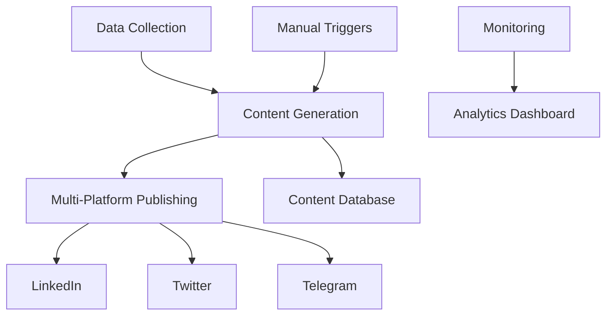

# 🚀 AI Finance Agency - Complete N8N Automation Setup Guide

## 📊 System Overview

This guide will help you set up a complete autonomous financial content system using N8N workflows. The system automatically:
- Fetches market data every 15 minutes
- Generates AI-powered financial content
- Posts to LinkedIn, Twitter, and Telegram
- Monitors performance and sends alerts

## 🏗️ Architecture



## 📋 Implementation Checklist

### Phase 1: Infrastructure Setup ⚙️

- [ ] **Install N8N**
  ```bash
  # Using Docker (Recommended)
  docker run -it --rm \
    --name n8n \
    -p 5678:5678 \
    -e N8N_BASIC_AUTH_ACTIVE=true \
    -e N8N_BASIC_AUTH_USER=admin \
    -e N8N_BASIC_AUTH_PASSWORD=your-password \
    -v ~/.n8n:/home/node/.n8n \
    n8nio/n8n
  
  # Or using npm
  npm install n8n -g
  n8n start
  ```

- [ ] **Setup PostgreSQL Database**
  ```bash
  # Using Docker
  docker run --name postgres-n8n \
    -e POSTGRES_PASSWORD=your-password \
    -e POSTGRES_DB=ai_finance_agency \
    -p 5432:5432 \
    -d postgres:15
  
  # Run the schema
  psql -U postgres -d ai_finance_agency -f n8n-workflows/database-schema.sql
  ```

- [ ] **Configure Environment Variables**
  Create `.env` file:
  ```env
  # N8N Configuration
  N8N_WEBHOOK_URL=https://your-domain.com
  N8N_BASIC_AUTH_ACTIVE=true
  N8N_BASIC_AUTH_USER=admin
  N8N_BASIC_AUTH_PASSWORD=secure-password
  
  # Database
  DB_TYPE=postgresdb
  DB_POSTGRESDB_DATABASE=ai_finance_agency
  DB_POSTGRESDB_HOST=localhost
  DB_POSTGRESDB_PORT=5432
  DB_POSTGRESDB_USER=postgres
  DB_POSTGRESDB_PASSWORD=your-password
  
  # API Keys
  OPENAI_API_KEY=sk-...
  TELEGRAM_BOT_TOKEN=...
  TELEGRAM_CHANNEL_ID=@YourChannel
  LINKEDIN_ACCESS_TOKEN=...
  TWITTER_API_KEY=...
  TWITTER_API_SECRET=...
  ```

- [ ] **Setup Reverse Proxy (nginx)**
  ```nginx
  server {
      listen 80;
      server_name n8n.yourdomain.com;
      return 301 https://$server_name$request_uri;
  }
  
  server {
      listen 443 ssl;
      server_name n8n.yourdomain.com;
      
      ssl_certificate /path/to/cert.pem;
      ssl_certificate_key /path/to/key.pem;
      
      location / {
          proxy_pass http://localhost:5678;
          proxy_http_version 1.1;
          proxy_set_header Upgrade $http_upgrade;
          proxy_set_header Connection 'upgrade';
          proxy_set_header Host $host;
          proxy_cache_bypass $http_upgrade;
      }
  }
  ```

- [ ] **Configure SSL Certificates**
  ```bash
  # Using Let's Encrypt
  sudo certbot --nginx -d n8n.yourdomain.com
  ```

### Phase 2: API Integrations 🔗

- [ ] **Register OpenAI API**
  1. Go to https://platform.openai.com/api-keys
  2. Create new API key
  3. Add to N8N credentials

- [ ] **Setup LinkedIn App & OAuth**
  1. Visit https://www.linkedin.com/developers/
  2. Create new app
  3. Add OAuth 2.0 redirect URL: `https://n8n.yourdomain.com/rest/oauth2-credential/callback`
  4. Copy Client ID and Secret

- [ ] **Configure Twitter Developer Account**
  1. Apply at https://developer.twitter.com/
  2. Create new app
  3. Generate API keys and tokens
  4. Enable OAuth 2.0

- [ ] **Create Telegram Bot**
  1. Message @BotFather on Telegram
  2. Create new bot: `/newbot`
  3. Get bot token
  4. Add bot to your channel as admin

- [ ] **Setup Slack Webhook** (for monitoring)
  1. Go to https://api.slack.com/apps
  2. Create new app
  3. Add Incoming Webhooks
  4. Copy webhook URL

### Phase 3: Workflow Deployment 📦

- [ ] **Import Workflows**
  1. Open N8N UI (http://localhost:5678)
  2. Go to Workflows → Import
  3. Import in order:
     - `1-market-data-collection.json`
     - `2-content-generation.json`
     - `3-multi-platform-publishing.json`
     - `4-monitoring-analytics.json`

- [ ] **Configure Credentials**
  For each workflow, set up:
  - PostgreSQL credentials
  - OpenAI credentials
  - LinkedIn OAuth2
  - Twitter OAuth2
  - Telegram credentials
  - Slack webhook

- [ ] **Test Webhook Endpoints**
  ```bash
  # Test content generation trigger
  curl -X POST https://n8n.yourdomain.com/webhook/content-generation \
    -H "Content-Type: application/json" \
    -d '{"test": true}'
  
  # Test publishing trigger
  curl -X POST https://n8n.yourdomain.com/webhook/publish-content \
    -H "Content-Type: application/json" \
    -d '{"platform": "telegram", "content": "Test post"}'
  ```

### Phase 4: Testing 🧪

- [ ] **Test Market Data Fetching**
  - Manually execute Data Collection workflow
  - Check database for market_data entries
  - Verify RSS feeds are being parsed

- [ ] **Verify Content Generation**
  - Trigger content generation webhook
  - Check OpenAI API response
  - Verify content uniqueness check

- [ ] **Test Platform Publishing**
  - Test each platform individually
  - Verify rate limiting works
  - Check publishing logs in database

- [ ] **Validate Deduplication**
  - Try posting same content twice
  - Verify hash comparison works
  - Check content_history table

- [ ] **Check Rate Limiting**
  - Monitor api_rate_limits table
  - Test alert generation
  - Verify platform throttling

### Phase 5: Monitoring Setup 📈

- [ ] **Configure Alerting Thresholds**
  ```sql
  UPDATE api_rate_limits SET 
    requests_limit = 100 
  WHERE platform = 'linkedin';
  ```

- [ ] **Setup Daily Reports**
  - Configure Slack channel
  - Set report time (default 8 PM)
  - Test report generation

- [ ] **Create Performance Dashboards**
  - Use N8N's built-in metrics
  - Or connect Grafana to PostgreSQL
  - Monitor key metrics:
    - Posts per platform
    - Success rates
    - API usage
    - Content variety

- [ ] **Setup Backup Workflows**
  - Export all workflows regularly
  - Backup database daily
  - Store credentials securely

### Phase 6: Production Launch 🚀

- [ ] **Enable All Scheduled Triggers**
  - Activate Data Collection (15 min)
  - Enable Monitoring (1 hour)
  - Start scheduled content generation

- [ ] **Monitor First 24 Hours**
  - Check all platforms posting
  - Verify no duplicate content
  - Monitor error rates
  - Review generated content quality

- [ ] **Fine-tune Scheduling**
  ```javascript
  // Adjust in workflow nodes
  const schedule = {
    linkedin: "0 9,14,19 * * *",  // 9 AM, 2 PM, 7 PM
    twitter: "0 */2 * * *",       // Every 2 hours
    telegram: "0 9-16 * * 1-5"    // Hourly during market hours
  };
  ```

- [ ] **Document Any Issues**
  - Keep log of errors
  - Note API limitations
  - Document workarounds

## 🔧 Troubleshooting

### Common Issues and Solutions

1. **Webhook Not Triggering**
   - Check N8N webhook URL in env
   - Verify SSL certificate
   - Test with curl command

2. **Database Connection Failed**
   - Check PostgreSQL is running
   - Verify credentials
   - Test connection: `psql -U postgres -d ai_finance_agency`

3. **Content Generation Failing**
   - Verify OpenAI API key
   - Check API quota
   - Review prompt formatting

4. **Platform Posting Errors**
   - Re-authenticate OAuth tokens
   - Check rate limits
   - Verify bot permissions (Telegram)

5. **Duplicate Content**
   - Check hash function
   - Verify content_history table
   - Increase similarity threshold

## 📊 Performance Metrics

Monitor these KPIs:
- **Content Generation Rate**: 24-48 posts/day
- **Platform Success Rate**: >95%
- **Content Uniqueness**: 100%
- **API Usage**: <80% of limits
- **System Uptime**: 99.9%

## 🔐 Security Best Practices

1. **Use Environment Variables** for all credentials
2. **Enable N8N Authentication**
3. **Use HTTPS** for all webhooks
4. **Rotate API Keys** monthly
5. **Backup Database** daily
6. **Monitor Access Logs**
7. **Use VPN** for admin access

## 📚 Additional Resources

- [N8N Documentation](https://docs.n8n.io/)
- [OpenAI API Docs](https://platform.openai.com/docs/)
- [LinkedIn API](https://docs.microsoft.com/en-us/linkedin/)
- [Twitter API v2](https://developer.twitter.com/en/docs)
- [Telegram Bot API](https://core.telegram.org/bots/api)

## 🎯 Quick Start Commands

```bash
# Start entire system
docker-compose up -d

# View logs
docker-compose logs -f n8n

# Execute workflow manually
curl -X POST http://localhost:5678/webhook/content-generation

# Check system status
psql -U postgres -d ai_finance_agency -c "SELECT * FROM daily_posting_stats;"

# Backup workflows
n8n export:workflow --all --output=backups/
```

## 💡 Pro Tips

1. **Start Small**: Test with one platform first
2. **Monitor Closely**: First week is critical
3. **Iterate Content**: Refine prompts based on performance
4. **Respect Limits**: Don't exceed API rate limits
5. **Stay Compliant**: Always include disclaimers
6. **Be Responsive**: Monitor alerts and fix issues quickly

---

## 🎉 Success Checklist

When everything is working, you should see:
- ✅ Market data updating every 15 minutes
- ✅ Content generating automatically on market moves
- ✅ Posts appearing on all platforms
- ✅ No duplicate content
- ✅ Daily reports in Slack
- ✅ Alerts for any issues
- ✅ <2% error rate
- ✅ Positive engagement metrics

---

**Last Updated**: September 2025
**Version**: 1.0.0
**Support**: Create issue in GitHub repo

Good luck with your AI Finance Agency automation! 🚀