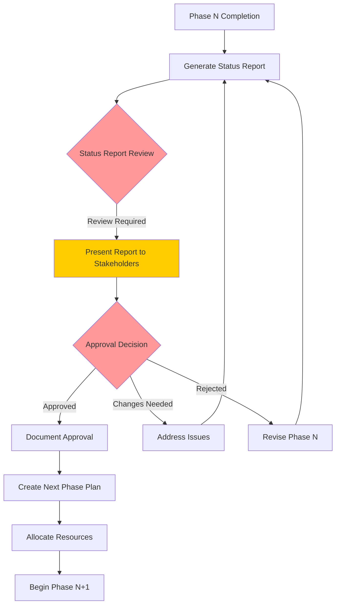

# Phase Transition Workflow - Mandatory Status Review Protocol
## Ensuring Status Reports Are Reviewed Before Next Phase Begins

---

## 🔒 MANDATORY REVIEW GATE SYSTEM

### Core Principle:
**NO PHASE SHALL BEGIN WITHOUT FORMAL REVIEW AND APPROVAL OF THE PREVIOUS PHASE'S STATUS REPORT**

---

## 🚦 PHASE TRANSITION WORKFLOW



---

## 📋 IMPLEMENTATION STEPS

### 1. **Phase Completion Trigger**
```python
# Automatic detection when phase tasks are marked complete
def check_phase_completion():
    if all_tasks_complete():
        trigger_status_report_generation()
        lock_next_phase_tasks()  # CRITICAL: Prevent starting next phase
        notify_stakeholders()
```

### 2. **Status Report Generation**
```python
# Generate comprehensive status report
def generate_phase_status_report(phase_id):
    report = compile_phase_metrics()
    report.add_executive_summary()
    report.add_technical_deliverables()
    report.add_risk_assessment()
    report.add_recommendations()

    # MANDATORY: Set review flag
    report.status = "PENDING_REVIEW"
    report.next_phase_locked = True

    return report
```

### 3. **Mandatory Review Process**
```python
# Review gate enforcement
def phase_review_gate(report):
    # Display report prominently
    display_full_status_report(report)

    # Require explicit acknowledgment
    review_checklist = [
        "Objectives met?",
        "Budget on track?",
        "Risks acceptable?",
        "Team performance satisfactory?",
        "Next phase plan clear?"
    ]

    if not all_items_checked(review_checklist):
        return "REVIEW_INCOMPLETE"

    # Require formal approval
    approval = request_approval()
    return approval
```

### 4. **Next Phase Unlock**
```python
# Only unlock after approval
def unlock_next_phase(approval_record):
    if approval_record.status == "APPROVED":
        unlock_phase_tasks()
        log_approval(approval_record)
        return "PHASE_UNLOCKED"
    else:
        return "PHASE_REMAINS_LOCKED"
```

---

## 🎯 WORKFLOW ENFORCEMENT RULES

### Mandatory Review Points:
1. **Before ANY new phase begins**
2. **At budget milestones (25%, 50%, 75%)**
3. **After critical failures or pivots**
4. **Before major resource allocations**
5. **At investor/stakeholder checkpoints**

### Review Requirements:
- ✅ Full status report must be generated
- ✅ Report must be displayed/presented
- ✅ All sections must be reviewed
- ✅ Issues must be acknowledged
- ✅ Approval must be documented
- ✅ Next phase plan must be confirmed

---

## 📊 STATUS REPORT REVIEW CHECKLIST

### Before Starting Next Phase, Confirm:

#### 1. **Executive Summary Review**
- [ ] Overall status understood
- [ ] Key achievements recognized
- [ ] Budget status acceptable
- [ ] Timeline adherence confirmed

#### 2. **Technical Deliverables**
- [ ] All features completed as planned
- [ ] Quality standards met
- [ ] Documentation complete
- [ ] Testing adequate

#### 3. **Risk Assessment**
- [ ] Current risks understood
- [ ] Mitigation plans in place
- [ ] New risks identified
- [ ] Contingencies prepared

#### 4. **Financial Analysis**
- [ ] Budget utilization appropriate
- [ ] ROI projections realistic
- [ ] Cost overruns addressed
- [ ] Next phase budget approved

#### 5. **Team Performance**
- [ ] Resource allocation effective
- [ ] Skills gaps identified
- [ ] Collaboration successful
- [ ] Improvements noted

#### 6. **Next Phase Planning**
- [ ] Objectives clearly defined
- [ ] Resources allocated
- [ ] Dependencies identified
- [ ] Success criteria established

---

## 🔄 PRACTICAL IMPLEMENTATION

### For Human Review:
```markdown
## ⚠️ PHASE REVIEW REQUIRED

**Current Phase**: Week 1-2 Sprint
**Status Report**: PHASE_1_WEEK_1-2_STATUS_REPORT.md
**Next Phase**: Week 3-4 Growth Sprint

### Review Status Report:
1. Open: `/reports/PHASE_1_WEEK_1-2_STATUS_REPORT.md`
2. Review all sections carefully
3. Note any concerns or questions
4. Confirm readiness for next phase

### Approval Options:
- ✅ APPROVE - Proceed to Week 3-4
- 🔄 REVISE - Address issues first
- ❌ REJECT - Major concerns need resolution

**Your Decision**: [Awaiting Input]
```

### For AI Agent Workflow:
```python
class PhaseTransitionManager:
    def __init__(self):
        self.current_phase = None
        self.next_phase_locked = True

    def complete_phase(self, phase_id):
        # Generate report
        report = self.generate_status_report(phase_id)

        # Lock next phase
        self.next_phase_locked = True

        # Display for review
        self.display_report_for_review(report)

        # Wait for approval
        return "AWAITING_REVIEW"

    def review_and_approve(self, decision):
        if decision == "APPROVED":
            self.next_phase_locked = False
            self.log_approval()
            return "PROCEED_TO_NEXT_PHASE"
        elif decision == "REVISE":
            return "ADDRESS_ISSUES"
        else:
            return "PHASE_REJECTED"

    def start_next_phase(self):
        if self.next_phase_locked:
            raise Exception("Cannot start next phase - Review pending!")

        # Proceed with next phase
        self.initialize_next_phase()
```

---

## 📝 STANDARD OPERATING PROCEDURE

### Every Phase Transition MUST:

1. **Generate Status Report** (Automatic)
   ```
   - Compile all phase metrics
   - Create comprehensive report
   - Store in `/reports/` directory
   ```

2. **Present for Review** (Mandatory)
   ```
   - Display full report
   - Highlight key metrics
   - Show risk assessment
   - Present recommendations
   ```

3. **Obtain Approval** (Required)
   ```
   - Review checklist completion
   - Formal approval decision
   - Document approval record
   - Log decision rationale
   ```

4. **Plan Next Phase** (Structured)
   ```
   - Define clear objectives
   - Allocate resources
   - Set success criteria
   - Identify dependencies
   ```

5. **Unlock and Proceed** (Controlled)
   ```
   - Unlock next phase tasks
   - Brief team on objectives
   - Initiate phase kickoff
   - Start progress tracking
   ```

---

## 🚨 ENFORCEMENT MECHANISMS

### Automatic Blocks:
- Next phase tasks remain locked until approval
- Resource allocation blocked without review
- API deployments prevented without sign-off
- Budget access restricted until review complete

### Notifications:
- Alert when phase complete
- Reminder if review pending >24 hours
- Escalation if blocked >48 hours
- Success confirmation when approved

### Audit Trail:
- All reviews logged with timestamp
- Approval decisions recorded
- Issues and resolutions tracked
- Lessons learned captured

---

## 📊 CURRENT STATUS

### Phase 1 (Week 1-2): ✅ COMPLETE
**Status Report**: Generated and stored
**Location**: `/talkingphoto-mvp/reports/PHASE_1_WEEK_1-2_STATUS_REPORT.md`

### ⚠️ REVIEW REQUIRED BEFORE PROCEEDING

**Next Phase**: Week 3-4 Growth Sprint
**Status**: 🔒 LOCKED - Awaiting Review

### Required Actions:
1. Review Phase 1 Status Report
2. Confirm all objectives met
3. Approve or request changes
4. Unlock Week 3-4 tasks

---

## 🎯 BENEFITS OF THIS WORKFLOW

1. **Quality Assurance**: No phase begins with unresolved issues
2. **Stakeholder Alignment**: Everyone informed before proceeding
3. **Risk Management**: Issues identified and addressed early
4. **Learning Integration**: Lessons applied to next phase
5. **Accountability**: Clear approval trail for decisions
6. **Resource Optimization**: Proper allocation based on review

---

## 📋 QUICK REFERENCE

### Commands for Phase Transition:
```bash
# Generate status report
ai-agent generate-status-report --phase=current

# Review status report
ai-agent review-report --display=full

# Approve and proceed
ai-agent approve-phase --unlock-next=true

# Request changes
ai-agent request-changes --issues="[list]"
```

---

*Workflow Version: 1.0*
*Implementation Date: September 13, 2025*
*Mandatory for: All project phases*
*Exception Process: Requires executive override with documentation*