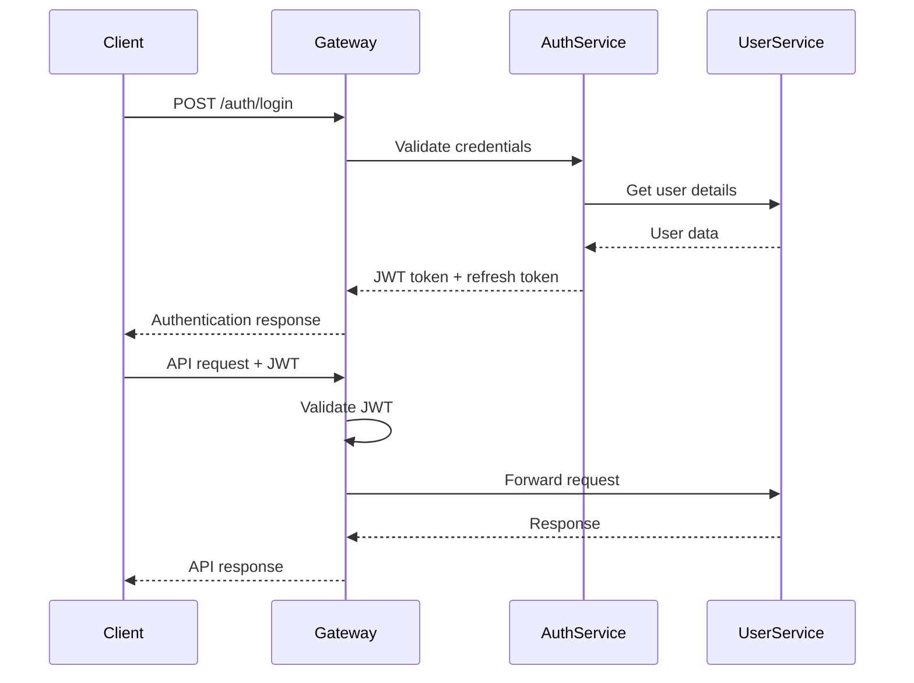

# TREUM ALGOTECH - Technical Architecture Document (Part 1)
## System Design & Microservices Architecture

---

## 1. Executive Summary

### Architecture Vision
TREUM ALGOTECH's architecture is designed as a cloud-native, event-driven microservices platform capable of supporting ₹600 Cr annual revenue with 1M+ concurrent users across three core pillars: Education, Signals, and Crypto Trading.

### Core Principles
- **Scalability First**: Horizontal scaling for 1M+ users
- **Real-time Performance**: Sub-100ms signal delivery
- **Financial Grade Security**: PCI DSS compliance for high-value transactions
- **Event-Driven Architecture**: Loose coupling with eventual consistency
- **API-First Design**: Unified interface for web, mobile, and third-party integrations

### Key Design Decisions
1. **Microservices over Monolith**: Independent scaling and deployment
2. **CQRS + Event Sourcing**: For financial transactions and audit trails
3. **Multi-database Strategy**: Optimized data stores per service
4. **Edge Computing**: Regional signal distribution for low latency
5. **Hybrid Cloud**: Critical services on private cloud, static content on CDN

---

## 2. System Architecture Overview

### High-Level Architecture

```
┌─────────────────────────────────────────────────────────────────┐
│                        TREUM ALGOTECH PLATFORM                  │
├─────────────────────────────────────────────────────────────────┤
│  Frontend Layer                                                 │
│  ┌─────────────┐  ┌─────────────┐  ┌─────────────┐             │
│  │ Web Portal  │  │ Mobile Apps │  │ Admin Panel │             │
│  │ (Next.js)   │  │(React Native│  │  (React)    │             │
│  └─────────────┘  └─────────────┘  └─────────────┘             │
├─────────────────────────────────────────────────────────────────┤
│  API Gateway Layer                                              │
│  ┌─────────────────────────────────────────────────────────────┐ │
│  │ Kong API Gateway + Auth0 + Rate Limiting + Load Balancer  │ │
│  └─────────────────────────────────────────────────────────────┘ │
├─────────────────────────────────────────────────────────────────┤
│  Microservices Layer                                           │
│  ┌──────────┐ ┌──────────┐ ┌──────────┐ ┌──────────┐ ┌────────┐│
│  │User Mgmt │ │Education │ │ Signals  │ │ Trading  │ │Payment ││
│  │ Service  │ │ Service  │ │ Service  │ │ Service  │ │Service ││
│  └──────────┘ └──────────┘ └──────────┘ └──────────┘ └────────┘│
│  ┌──────────┐ ┌──────────┐ ┌──────────┐ ┌──────────┐           │
│  │Analytics │ │Notification│ │ Content  │ │ Audit    │           │
│  │ Service  │ │ Service   │ │ Service  │ │ Service  │           │
│  └──────────┘ └──────────┘ └──────────┘ └──────────┘           │
├─────────────────────────────────────────────────────────────────┤
│  Data Layer                                                     │
│  ┌──────────┐ ┌──────────┐ ┌──────────┐ ┌──────────┐           │
│  │PostgreSQL│ │ MongoDB  │ │  Redis   │ │InfluxDB  │           │
│  │(Transact)│ │(Content) │ │ (Cache)  │ │(Metrics) │           │
│  └──────────┘ └──────────┘ └──────────┘ └──────────┘           │
├─────────────────────────────────────────────────────────────────┤
│  Message & Event Layer                                         │
│  ┌─────────────────────────────────────────────────────────────┐ │
│  │ Apache Kafka + Event Store + WebSocket Clusters           │ │
│  └─────────────────────────────────────────────────────────────┘ │
└─────────────────────────────────────────────────────────────────┘
```

### Component Interactions

**Request Flow**:
1. Client → API Gateway → Authentication → Service
2. Service → Event Bus → Dependent Services
3. Service → Database → Cache → Response

**Event Flow**:
1. Signal Generated → Kafka Topic → Real-time Distribution
2. Payment Processed → Event Store → Audit & Analytics
3. User Action → Event Bus → Multiple Service Updates

---

## 3. Microservices Architecture

### 3.1 User Management Service

**Responsibilities**:
- Authentication & Authorization (JWT + OAuth2)
- KYC verification and compliance
- User profiles and preferences
- Role-based access control (RBAC)

**API Endpoints**:
```
POST /auth/login
POST /auth/register
POST /auth/verify-kyc
GET  /users/{id}/profile
PUT  /users/{id}/preferences
```

**Database Schema**:
```sql
-- Primary: PostgreSQL
users: id, email, phone, kyc_status, created_at
user_profiles: user_id, first_name, last_name, pan, address
user_sessions: session_id, user_id, expires_at, device_info
user_roles: user_id, role_id, assigned_at
```

**Scaling Strategy**:
- Read replicas for profile queries
- Redis session store for horizontal scaling
- JWT for stateless authentication

### 3.2 Education Platform Service

**Responsibilities**:
- Course catalog management
- Video streaming and content delivery
- Progress tracking and analytics
- Certification and assessments

**API Endpoints**:
```
GET  /courses
GET  /courses/{id}/modules
POST /courses/{id}/enroll
GET  /users/{id}/progress
POST /assessments/{id}/submit
```

**Database Schema**:
```sql
-- Primary: MongoDB
courses: {id, title, price, modules[], instructor_id, created_at}
enrollments: {user_id, course_id, progress, completed_at}
videos: {id, course_id, url, duration, transcripts}
assessments: {id, course_id, questions[], passing_score}
```

**Scaling Strategy**:
- CDN for video content delivery
- MongoDB sharding by course_id
- Elasticsearch for course search

### 3.3 Signal Generation Service

**Responsibilities**:
- AI/ML signal generation
- Real-time signal distribution
- Signal performance tracking
- Subscription management

**API Endpoints**:
```
GET  /signals/live
POST /signals/subscribe
GET  /signals/history
GET  /signals/performance
WebSocket: /ws/signals/stream
```

**Database Schema**:
```sql
-- Primary: InfluxDB + Redis
signals: timestamp, symbol, action, confidence, price_target
subscriptions: user_id, plan_id, active, expires_at
signal_performance: signal_id, actual_return, accuracy
```

**Scaling Strategy**:
- WebSocket clusters for real-time delivery
- Redis pub/sub for signal distribution
- Edge nodes for regional latency optimization

### 3.4 Trading Integration Service

**Responsibilities**:
- Exchange API integrations
- Order execution and management
- Portfolio tracking
- Risk management

**API Endpoints**:
```
POST /trading/orders
GET  /trading/portfolio
GET  /trading/positions
POST /trading/exchanges/connect
```

**Database Schema**:
```sql
-- Primary: PostgreSQL with Event Sourcing
orders: id, user_id, symbol, quantity, price, status, created_at
positions: user_id, symbol, quantity, avg_price, unrealized_pnl
exchange_accounts: user_id, exchange_id, api_key_hash, status
trade_events: event_id, order_id, event_type, data, timestamp
```

**Scaling Strategy**:
- Event sourcing for audit trails
- CQRS for read/write separation
- Circuit breakers for exchange API reliability

### 3.5 Payment Processing Service

**Responsibilities**:
- Course payments (₹24K-₹8L transactions)
- Subscription billing
- Refund processing
- Financial reconciliation

**API Endpoints**:
```
POST /payments/create
GET  /payments/{id}/status
POST /payments/refund
GET  /billing/invoices
```

**Database Schema**:
```sql
-- Primary: PostgreSQL with encryption
payments: id, user_id, amount, currency, status, gateway, created_at
subscriptions: id, user_id, plan_id, billing_cycle, next_billing
transactions: id, payment_id, gateway_txn_id, amount, fees
financial_records: id, type, amount, description, reconciled_at
```

**Scaling Strategy**:
- PCI DSS compliant infrastructure
- Encrypted sensitive data at rest
- Multiple payment gateway integration

---

## 4. Technology Stack

### Frontend Stack
```yaml
Web Application:
  Framework: Next.js 14 (React 18)
  State: Redux Toolkit + RTK Query
  UI: Tailwind CSS + HeadlessUI
  Charts: TradingView Widgets
  
Mobile Applications:
  Framework: React Native 0.72
  Navigation: React Navigation 6
  State: Redux Toolkit
  UI: NativeBase + React Native Elements

Admin Dashboard:
  Framework: React 18 + Vite
  UI: Ant Design Pro
  Charts: Apache ECharts
```

### Backend Stack
```yaml
Microservices:
  Primary: Node.js 20 (Express.js + TypeScript)
  AI/ML: Python 3.11 (FastAPI + Pydantic)
  Gateway: Kong Community + Lua plugins
  
API Architecture:
  REST: OpenAPI 3.0 specification
  GraphQL: Apollo Server (for complex queries)
  Real-time: Socket.io + Redis adapter
  
Authentication:
  JWT: jsonwebtoken + RS256
  OAuth2: Auth0 integration
  2FA: TOTP (speakeasy library)
```

### Database Stack
```yaml
Primary Databases:
  Transactional: PostgreSQL 15 (Multi-master)
  Document: MongoDB 6.0 (Replica Set)
  Cache: Redis 7.0 (Cluster mode)
  Time-series: InfluxDB 2.0
  
Search & Analytics:
  Search: Elasticsearch 8.0
  Analytics: ClickHouse
  Event Store: EventStore DB
```

### Message Queue & Streaming
```yaml
Event Streaming:
  Primary: Apache Kafka 3.5
  Schema: Confluent Schema Registry
  Connect: Kafka Connect for ETL
  
Real-time Communication:
  WebSockets: Socket.io clusters
  Push Notifications: Firebase FCM
  Email: SendGrid API
```

### AI/ML Stack
```yaml
Machine Learning:
  Framework: TensorFlow 2.13 + PyTorch 2.0
  Deployment: TensorFlow Serving + MLflow
  Features: Apache Airflow pipelines
  
Data Processing:
  Streaming: Apache Spark 3.4
  Batch: Apache Airflow + Pandas
  Real-time: Apache Kafka Streams
```

---

## 5. API Architecture

### 5.1 REST vs GraphQL Strategy

**REST API Usage**:
- CRUD operations (95% of endpoints)
- Real-time data endpoints
- Third-party integrations
- Mobile app APIs

**GraphQL Usage**:
- Complex data aggregation queries
- Admin dashboard analytics
- Course content with nested relationships
- User profile with related data

### 5.2 API Gateway Design

**Kong API Gateway Configuration**:
```yaml
Services:
  - name: user-service
    url: http://user-service:3001
    plugins:
      - rate-limiting: 1000/minute
      - jwt-auth: enabled
      - cors: enabled
      
  - name: signals-service
    url: http://signals-service:3002
    plugins:
      - rate-limiting: 10000/minute (premium users)
      - subscription-check: enabled
      - websocket-proxy: enabled
```

### 5.3 Rate Limiting Strategy

**Tier-based Rate Limits**:
```yaml
Free Users:
  - API calls: 100/hour
  - Signals: 5/day
  - Video streaming: 2 hours/day

Premium Users (₹999-₹2999/month):
  - API calls: 1000/hour
  - Signals: Unlimited
  - Video streaming: Unlimited

Enterprise Users (₹9999/month):
  - API calls: 10000/hour
  - Signals: Real-time + historical
  - Priority support APIs
```

### 5.4 Authentication Flow

**JWT + OAuth2 Flow**:


**Security Features**:
- RS256 JWT signing
- 15-minute access token expiry
- 7-day refresh token rotation
- Device fingerprinting
- Geo-location validation for high-value transactions

---

## Performance Requirements

### Response Time SLAs
- Authentication: < 200ms (99th percentile)
- Signal delivery: < 100ms (real-time)
- Course streaming: < 500ms initial load
- Payment processing: < 2 seconds
- API queries: < 300ms (95th percentile)

### Throughput Requirements
- Concurrent users: 1M+
- API requests: 100K/second peak
- WebSocket connections: 500K concurrent
- Video streaming: 10K concurrent streams
- Signal distribution: 1M users in < 5 seconds

### Availability Targets
- Core services: 99.9% uptime
- Payment system: 99.95% uptime
- Signal delivery: 99.8% uptime
- Content delivery: 99.9% uptime

---

This completes Part 1 of the technical architecture document covering system design and microservices architecture. Part 2 will focus on infrastructure, security, scalability, and deployment strategies.