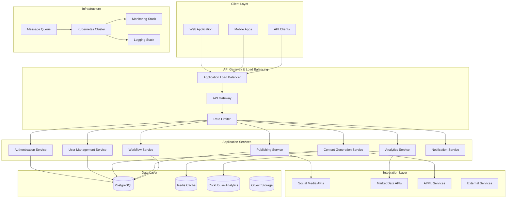
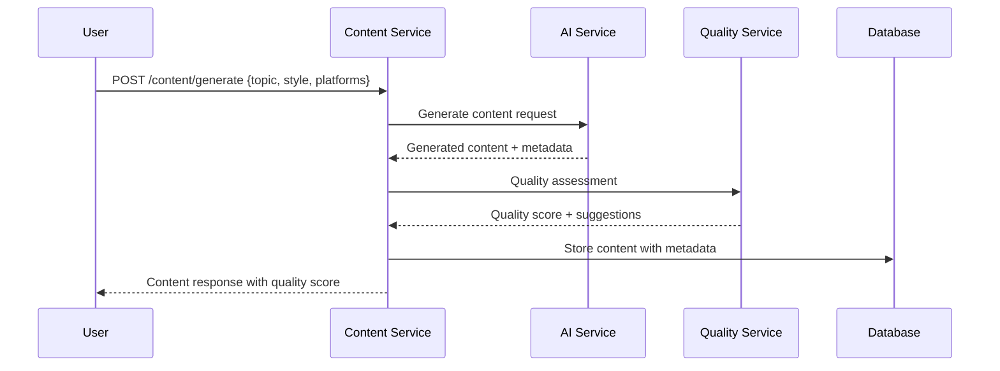
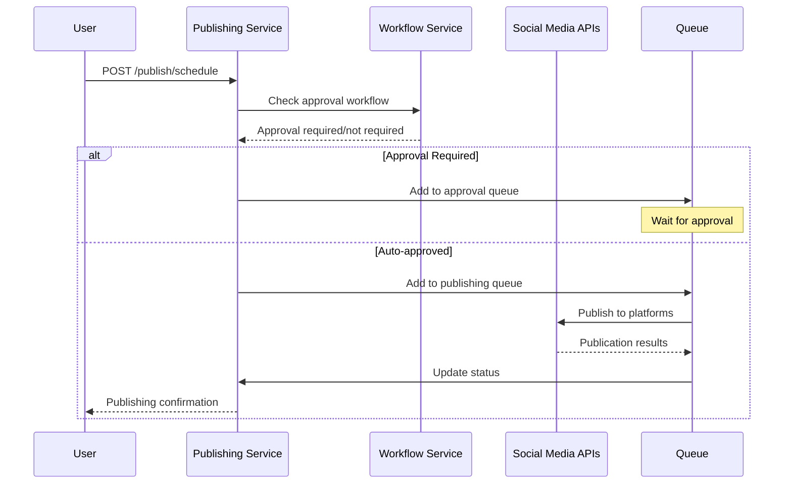

# Architecture Document: AI Finance Agency Platform

## Document Control

- **Version**: 1.0
- **Date**: 2025-01-10  
- **Status**: Draft
- **Owner**: Architecture Team
- **Stakeholders**: Engineering, DevOps, Security, Product

## Executive Summary

This document defines the technical architecture for transforming the AI Finance Agency from a collection of Python scripts into a cloud-native, microservices-based SaaS platform. The architecture emphasizes scalability, security, maintainability, and regulatory compliance while providing enterprise-grade performance and reliability.

## Architecture Principles

### Core Principles
1. **Microservices-First**: Loosely coupled services with single responsibilities
2. **API-Driven**: All functionality exposed through well-designed APIs
3. **Event-Driven**: Asynchronous communication for scalability and resilience
4. **Security-by-Design**: Security considerations at every architectural layer
5. **Cloud-Native**: Designed for containerized, auto-scaling deployment
6. **Data-Driven**: Analytics and monitoring built into every component

### Technology Principles  
1. **Polyglot Architecture**: Right tool for each job (Python, TypeScript, Go)
2. **Open Source Preferred**: Leverage mature open-source solutions
3. **Vendor Agnostic**: Avoid vendor lock-in where possible
4. **DevOps Integration**: Infrastructure as code, automated deployments
5. **Observability First**: Comprehensive monitoring, logging, and tracing

## System Overview

### High-Level Architecture



## Microservices Architecture

### Service Decomposition

#### 1. Authentication Service
**Responsibility**: User authentication, authorization, session management
- **Technology**: Python FastAPI, JWT tokens, OAuth2
- **Database**: PostgreSQL (user credentials, sessions)
- **APIs Exposed**: `/auth/login`, `/auth/logout`, `/auth/refresh`, `/auth/verify`
- **Dependencies**: User Management Service, External OAuth providers

#### 2. User Management Service
**Responsibility**: User profiles, organizations, role-based access control  
- **Technology**: Python FastAPI, SQLAlchemy ORM
- **Database**: PostgreSQL (users, organizations, roles)
- **APIs Exposed**: `/users/*`, `/organizations/*`, `/roles/*`
- **Dependencies**: Authentication Service

#### 3. Content Generation Service  
**Responsibility**: AI-powered content creation, quality scoring, compliance validation
- **Technology**: Python FastAPI, Celery for async processing
- **Database**: PostgreSQL (content metadata), Redis (cache)
- **APIs Exposed**: `/content/generate`, `/content/quality-check`, `/content/compliance`
- **Dependencies**: AI Services (OpenAI, Claude), Market Data APIs

#### 4. Publishing Service
**Responsibility**: Multi-platform posting, scheduling, queue management
- **Technology**: Python FastAPI, Celery workers
- **Database**: PostgreSQL (publishing queue, status), Redis (temp data)
- **APIs Exposed**: `/publish/schedule`, `/publish/status`, `/publish/platforms`  
- **Dependencies**: Social Media APIs, Content Service

#### 5. Analytics Service
**Responsibility**: Performance tracking, engagement analytics, reporting
- **Technology**: Python FastAPI, pandas, numpy
- **Database**: ClickHouse (time-series data), Redis (real-time metrics)
- **APIs Exposed**: `/analytics/metrics`, `/analytics/reports`, `/analytics/dashboards`
- **Dependencies**: Social Media APIs, Publishing Service

#### 6. Workflow Service
**Responsibility**: Content approval workflows, compliance processes
- **Technology**: Python FastAPI, workflow engine (Zeebe or custom)
- **Database**: PostgreSQL (workflow state, approvals)
- **APIs Exposed**: `/workflows/start`, `/workflows/approve`, `/workflows/status`
- **Dependencies**: User Management, Content Generation

#### 7. Notification Service  
**Responsibility**: Email, SMS, in-app notifications, webhooks
- **Technology**: Python FastAPI, Celery, templating engine
- **Database**: PostgreSQL (notification history), Redis (queuing)
- **APIs Exposed**: `/notifications/send`, `/notifications/preferences`, `/webhooks`
- **Dependencies**: User Management, external notification providers

### Inter-Service Communication

#### Synchronous Communication (HTTP/REST)
- **Use Cases**: Real-time queries, user-initiated actions
- **Implementation**: HTTP/1.1 with connection pooling, circuit breakers
- **Security**: mTLS between services, JWT token validation
- **Error Handling**: Retry logic with exponential backoff

#### Asynchronous Communication (Message Queues)
- **Technology**: RabbitMQ with topic exchanges
- **Use Cases**: Background processing, event notifications, data synchronization
- **Message Patterns**: 
  - **Command**: Direct service invocation (content.generate.requested)
  - **Event**: Broadcast notifications (content.published, user.created)
  - **Query**: Request-response with correlation IDs

#### Event Sourcing & CQRS (Selected Services)
- **Services**: Content Generation, Analytics  
- **Event Store**: PostgreSQL with event sourcing table design
- **Benefits**: Audit trail, data consistency, replay capabilities
- **Read Models**: Optimized views for common query patterns

## Data Architecture

### Database Design Strategy

#### PostgreSQL (Primary Operational Store)
**Schema Design**:
```sql
-- Core tenant/organization model
CREATE TABLE organizations (
    id UUID PRIMARY KEY DEFAULT gen_random_uuid(),
    name VARCHAR(255) NOT NULL,
    domain VARCHAR(255) UNIQUE,
    settings JSONB DEFAULT '{}',
    created_at TIMESTAMP DEFAULT CURRENT_TIMESTAMP,
    updated_at TIMESTAMP DEFAULT CURRENT_TIMESTAMP
);

-- User management with RBAC
CREATE TABLE users (
    id UUID PRIMARY KEY DEFAULT gen_random_uuid(),
    email VARCHAR(255) NOT NULL UNIQUE,
    organization_id UUID REFERENCES organizations(id),
    role user_role_enum NOT NULL,
    profile JSONB DEFAULT '{}',
    is_active BOOLEAN DEFAULT true,
    created_at TIMESTAMP DEFAULT CURRENT_TIMESTAMP,
    last_login TIMESTAMP
);

-- Content with versioning
CREATE TABLE content (
    id UUID PRIMARY KEY DEFAULT gen_random_uuid(),
    organization_id UUID REFERENCES organizations(id),
    creator_id UUID REFERENCES users(id),
    version INTEGER DEFAULT 1,
    title VARCHAR(500),
    body TEXT,
    content_type content_type_enum,
    platforms TEXT[],
    status content_status_enum DEFAULT 'draft',
    quality_score DECIMAL(3,2),
    compliance_flags JSONB DEFAULT '[]',
    metadata JSONB DEFAULT '{}',
    scheduled_for TIMESTAMP,
    published_at TIMESTAMP,
    created_at TIMESTAMP DEFAULT CURRENT_TIMESTAMP,
    updated_at TIMESTAMP DEFAULT CURRENT_TIMESTAMP
);

-- Publishing queue and status tracking  
CREATE TABLE publishing_queue (
    id UUID PRIMARY KEY DEFAULT gen_random_uuid(),
    content_id UUID REFERENCES content(id),
    platform VARCHAR(50) NOT NULL,
    scheduled_for TIMESTAMP NOT NULL,
    status queue_status_enum DEFAULT 'pending',
    attempts INTEGER DEFAULT 0,
    last_attempt TIMESTAMP,
    error_message TEXT,
    external_post_id VARCHAR(255),
    created_at TIMESTAMP DEFAULT CURRENT_TIMESTAMP
);
```

**Performance Optimizations**:
- **Partitioning**: Time-based partitioning for content and analytics tables
- **Indexing**: B-tree indexes on foreign keys, GIN indexes on JSONB columns
- **Connection Pooling**: PgBouncer for connection management
- **Read Replicas**: Separate read replicas for analytics queries

#### Redis (Cache & Session Store)
**Use Cases**:
- **Session Storage**: User sessions with 24-hour TTL
- **Content Cache**: Generated content cache (1-hour TTL)
- **Rate Limiting**: Token bucket counters for API rate limiting  
- **Real-time Metrics**: Live engagement statistics
- **Job Queues**: Celery task queuing and results

**Configuration**:
```yaml
redis:
  cluster_mode: enabled
  nodes: 3
  memory_policy: allkeys-lru
  persistence: rdb_and_aof
  ssl_enabled: true
```

#### ClickHouse (Analytics Store)
**Schema Design**:
```sql
-- Time-series analytics data
CREATE TABLE content_metrics (
    timestamp DateTime,
    organization_id String,
    content_id String,
    platform String,
    metric_type Enum8('view'=1, 'like'=2, 'share'=3, 'comment'=4, 'click'=5),
    value UInt32,
    user_demographics Map(String, String),
    content_metadata Map(String, String)
) ENGINE = MergeTree()
PARTITION BY toYYYYMM(timestamp)
ORDER BY (organization_id, content_id, platform, timestamp);

-- Aggregated daily statistics
CREATE MATERIALIZED VIEW daily_metrics
ENGINE = SummingMergeTree()
PARTITION BY toYYYYMM(date)
ORDER BY (organization_id, date, platform)
AS SELECT
    toDate(timestamp) as date,
    organization_id,
    platform,
    count() as total_events,
    sumIf(value, metric_type = 'view') as total_views,
    sumIf(value, metric_type = 'like') as total_likes,
    sumIf(value, metric_type = 'share') as total_shares
FROM content_metrics
GROUP BY date, organization_id, platform;
```

### Data Flow Architecture

#### Content Generation Flow


#### Publishing Flow


## Security Architecture

### Authentication & Authorization

#### Identity Provider Integration
- **Primary**: Custom OAuth2 server with JWT tokens
- **External SSO**: Google Workspace, Microsoft 365, Okta integration
- **Token Strategy**: 
  - **Access Tokens**: Short-lived (15 minutes), contain user claims
  - **Refresh Tokens**: Long-lived (7 days), secure storage only
  - **API Keys**: Long-lived tokens for programmatic access

#### Role-Based Access Control (RBAC)
```yaml
Roles:
  super_admin:
    permissions: ["*"]
    description: "Platform administrator with all permissions"
    
  org_admin:  
    permissions: ["org:*", "user:*", "content:*", "analytics:read"]
    description: "Organization administrator"
    
  editor:
    permissions: ["content:create", "content:edit", "content:delete", "analytics:read"]
    description: "Content creator and editor"
    
  approver:
    permissions: ["content:approve", "content:reject", "analytics:read"] 
    description: "Content approval authority"
    
  viewer:
    permissions: ["content:read", "analytics:read"]
    description: "Read-only access to content and analytics"
```

### Network Security

#### Infrastructure Security
- **VPC Design**: Private subnets for services, public subnets for load balancers
- **Network ACLs**: Restrictive rules allowing only necessary traffic
- **Security Groups**: Application-level firewall rules
- **NAT Gateways**: Secure outbound internet access for private subnets

#### API Security  
- **WAF (Web Application Firewall)**: AWS WAF with OWASP rule sets
- **DDoS Protection**: CloudFlare or AWS Shield Advanced
- **Rate Limiting**: Token bucket algorithm with per-user and per-IP limits
- **Input Validation**: Schema validation for all API inputs
- **Output Sanitization**: Prevent XSS and injection attacks

#### Data Protection
- **Encryption at Rest**: AES-256 encryption for all data stores
- **Encryption in Transit**: TLS 1.3 for all communications
- **Key Management**: AWS KMS or HashiCorp Vault for key rotation
- **Data Masking**: PII masking in non-production environments

### Compliance & Governance

#### Regulatory Compliance
- **SOC 2 Type II**: Comprehensive controls framework
- **GDPR**: Data privacy and user consent management  
- **CCPA**: California consumer privacy requirements
- **Financial Regulations**: SEC, FINRA content supervision

#### Audit & Monitoring
```yaml
Audit Requirements:
  user_actions:
    retention: "7 years"
    fields: ["user_id", "action", "timestamp", "ip_address", "user_agent"]
    
  content_lifecycle:
    retention: "10 years" 
    fields: ["content_id", "status_changes", "approvals", "publications"]
    
  api_access:
    retention: "1 year"
    fields: ["endpoint", "method", "user_id", "response_code", "timestamp"]
    
  security_events:
    retention: "5 years"
    fields: ["event_type", "source_ip", "user_id", "threat_level", "response_action"]
```

## Integration Architecture

### Social Media API Integration

#### Platform Integrations
```yaml
LinkedIn:
  api_version: "v2"
  authentication: "OAuth 2.0"
  rate_limits: "300 requests/hour per token"
  content_types: ["text", "image", "video", "article"]
  max_text_length: 3000
  
Twitter:  
  api_version: "v2"
  authentication: "OAuth 2.0" 
  rate_limits: "300 tweets/15-min window"
  content_types: ["text", "image", "video"]
  max_text_length: 280
  
Telegram:
  api_version: "Bot API 6.0"
  authentication: "Bot Token"
  rate_limits: "30 messages/second"
  content_types: ["text", "image", "video", "document"]
  max_text_length: 4096
```

#### Integration Patterns
- **Circuit Breaker**: Prevent cascade failures from platform outages
- **Retry Logic**: Exponential backoff with jitter for transient failures
- **Fallback Mechanisms**: Alternative posting strategies when primary fails
- **Rate Limit Handling**: Intelligent queuing to respect platform limits

### AI/ML Service Integration

#### Content Generation Pipeline

```mermaid
graph LR
    INPUT[User Request] --> PREPROCESS[Preprocessing]
    PREPROCESS --> MARKET_DATA[Market Data Enrichment]
    MARKET_DATA --> AI_GENERATION[AI Content Generation]
    AI_GENERATION --> QUALITY_CHECK[Quality Assessment]
    QUALITY_CHECK --> COMPLIANCE[Compliance Validation]
    COMPLIANCE --> OPTIMIZATION[Platform Optimization]
    OPTIMIZATION --> OUTPUT[Final Content]
```


#### AI Provider Strategy
- **Primary**: OpenAI GPT-4 for content generation  
- **Secondary**: Anthropic Claude for compliance checking
- **Fallback**: Open-source models (Llama 2) for basic tasks
- **Cost Optimization**: Model selection based on task complexity

### Market Data Integration

#### Data Providers
- **Real-time Quotes**: Alpha Vantage, Yahoo Finance APIs
- **News Feeds**: NewsAPI, RSS aggregation
- **Economic Data**: Federal Reserve APIs, trading economics
- **Sentiment Analysis**: Custom NLP pipeline

#### Data Processing Pipeline
```yaml
Data Flow:
  ingestion:
    frequency: "Real-time streaming"
    sources: ["market_apis", "news_feeds", "economic_indicators"]
    format: "JSON over HTTP/WebSocket"
    
  processing:
    engine: "Apache Kafka + Kafka Streams"
    transformations: ["normalization", "enrichment", "sentiment_analysis"]
    storage: "ClickHouse for analytics, Redis for real-time cache"
    
  delivery:  
    apis: ["REST endpoints", "WebSocket streams", "GraphQL subscriptions"]
    caching: "Multi-layer caching strategy"
    rate_limits: "Based on subscription tier"
```

## Deployment Architecture

### Container Strategy

#### Kubernetes Deployment
```yaml
# Example service deployment
apiVersion: apps/v1
kind: Deployment
metadata:
  name: content-generation-service
spec:
  replicas: 3
  selector:
    matchLabels:
      app: content-generation-service
  template:
    metadata:
      labels:
        app: content-generation-service
    spec:
      containers:
      - name: content-service
        image: ai-finance-agency/content-service:v1.2.3
        ports:
        - containerPort: 8000
        env:
        - name: DATABASE_URL
          valueFrom:
            secretKeyRef:
              name: db-secrets
              key: postgres-url
        resources:
          requests:
            memory: "512Mi"
            cpu: "250m"
          limits:
            memory: "1Gi" 
            cpu: "500m"
        livenessProbe:
          httpGet:
            path: /health
            port: 8000
          initialDelaySeconds: 30
          periodSeconds: 10
        readinessProbe:
          httpGet:
            path: /ready
            port: 8000
          initialDelaySeconds: 5
          periodSeconds: 5
```

#### Service Mesh (Istio)
- **Traffic Management**: Intelligent routing, load balancing
- **Security**: mTLS between services, network policies
- **Observability**: Distributed tracing, metrics collection
- **Reliability**: Circuit breakers, timeouts, retries

### Infrastructure as Code

#### Terraform Configuration
```hcl
# VPC and networking
module "vpc" {
  source = "terraform-aws-modules/vpc/aws"
  
  name = "ai-finance-agency-vpc"
  cidr = "10.0.0.0/16"
  
  azs             = ["us-west-2a", "us-west-2b", "us-west-2c"]
  private_subnets = ["10.0.1.0/24", "10.0.2.0/24", "10.0.3.0/24"]
  public_subnets  = ["10.0.101.0/24", "10.0.102.0/24", "10.0.103.0/24"]
  
  enable_nat_gateway = true
  enable_vpn_gateway = true
  
  tags = {
    Terraform = "true"
    Environment = "production"
  }
}

# EKS cluster
module "eks" {
  source = "terraform-aws-modules/eks/aws"
  
  cluster_name    = "ai-finance-agency"
  cluster_version = "1.24"
  
  vpc_id     = module.vpc.vpc_id
  subnet_ids = module.vpc.private_subnets
  
  node_groups = {
    main = {
      desired_capacity = 3
      max_capacity     = 10
      min_capacity     = 3
      
      instance_types = ["m5.large"]
      
      k8s_labels = {
        Environment = "production"
        Application = "ai-finance-agency"
      }
    }
  }
}
```

### CI/CD Pipeline

#### GitOps Workflow
```yaml
# .github/workflows/deploy.yml
name: Deploy to Production

on:
  push:
    branches: [main]
    paths: ['services/**']

jobs:
  test:
    runs-on: ubuntu-latest
    steps:
    - uses: actions/checkout@v3
    - name: Run Tests
      run: |
        python -m pytest tests/ --cov=src/
        
  security-scan:
    runs-on: ubuntu-latest  
    steps:
    - uses: actions/checkout@v3
    - name: Security Scan
      uses: securecodewarrior/github-action-add-sarif@v1
      
  build-and-push:
    needs: [test, security-scan]
    runs-on: ubuntu-latest
    steps:
    - uses: actions/checkout@v3
    - name: Build and Push Docker Images  
      run: |
        docker build -t ai-finance-agency/content-service:${{ github.sha }} services/content/
        docker push ai-finance-agency/content-service:${{ github.sha }}
        
  deploy:
    needs: build-and-push
    runs-on: ubuntu-latest
    steps:
    - name: Deploy to Kubernetes
      run: |
        kubectl set image deployment/content-service content-service=ai-finance-agency/content-service:${{ github.sha }}
        kubectl rollout status deployment/content-service
```

## Monitoring & Observability

### Monitoring Stack

#### Metrics (Prometheus + Grafana)
```yaml
# Key metrics to monitor
Business Metrics:
  - content_generation_rate
  - content_quality_score_avg  
  - posts_published_daily
  - user_engagement_rate
  - api_usage_by_tenant

Technical Metrics:
  - service_response_time_p95
  - service_error_rate
  - database_connection_pool_utilization
  - message_queue_depth
  - kubernetes_pod_cpu_memory_usage

Infrastructure Metrics:
  - node_cpu_utilization
  - node_memory_utilization  
  - disk_io_utilization
  - network_throughput
  - ssl_certificate_expiry
```

#### Logging (ELK Stack)
```yaml
Log Aggregation:
  collection: "Filebeat on each pod"
  processing: "Logstash with filters and parsing"
  storage: "Elasticsearch cluster"
  visualization: "Kibana dashboards"
  
Log Structure:
  format: "JSON with structured fields"
  required_fields: ["timestamp", "service", "level", "message", "trace_id"]
  retention: "30 days hot, 90 days warm, 1 year cold"
  
Alert Rules:
  - error_rate > 1% for 5 minutes
  - response_time_p95 > 500ms for 5 minutes
  - failed_logins > 10 per minute from same IP
  - disk_space < 10% remaining
```

#### Distributed Tracing (Jaeger)
- **Trace Collection**: OpenTelemetry instrumentation
- **Sampling Strategy**: 1% for normal traffic, 100% for errors
- **Correlation**: Request tracing across all microservices
- **Performance Analysis**: Bottleneck identification and optimization

### Alerting Strategy

#### Alert Levels
```yaml
Critical (PagerDuty):
  - service_down
  - data_breach_detected
  - payment_processing_failure
  - database_connection_lost
  
Warning (Slack):
  - high_error_rate
  - slow_response_times  
  - disk_space_low
  - ssl_expiring_soon
  
Info (Email):
  - deployment_completed
  - backup_completed
  - maintenance_scheduled
  - usage_threshold_reached
```

## Performance & Scalability

### Performance Requirements

#### Response Time Targets
- **API Endpoints**: 95th percentile < 200ms
- **Content Generation**: < 30 seconds for complex requests
- **Database Queries**: 99% under 100ms  
- **Static Assets**: < 100ms with CDN
- **Real-time Updates**: < 1 second propagation

#### Throughput Targets
- **Concurrent Users**: 10,000 per region
- **API Requests**: 100,000 requests/minute
- **Content Generation**: 1,000 requests/minute
- **Social Media Posts**: 10,000 posts/day
- **Analytics Processing**: 1M events/hour

### Scalability Strategy

#### Horizontal Scaling
```yaml
Auto Scaling Policies:
  content_service:
    metric: "cpu_utilization"
    target: 70%
    min_replicas: 3
    max_replicas: 20
    scale_up_cooldown: 300s
    scale_down_cooldown: 900s
    
  publishing_service:  
    metric: "queue_depth"
    target: 100_messages
    min_replicas: 2
    max_replicas: 15
    
  analytics_service:
    metric: "memory_utilization" 
    target: 80%
    min_replicas: 2
    max_replicas: 10
```

#### Database Scaling
- **Read Replicas**: Separate replicas for analytics workloads
- **Connection Pooling**: PgBouncer with 100 connections per service
- **Query Optimization**: Automated index suggestions and query analysis
- **Partitioning**: Time-based partitioning for large tables

#### Caching Strategy
```yaml
Multi-Layer Caching:
  application_cache:
    technology: "Redis"
    use_cases: ["user_sessions", "frequent_queries", "generated_content"]
    ttl: "1 hour to 24 hours based on use case"
    
  cdn_cache:
    technology: "CloudFlare" 
    use_cases: ["static_assets", "api_responses", "public_content"]
    ttl: "1 day for static, 5 minutes for dynamic"
    
  database_cache:
    technology: "PostgreSQL shared_buffers"
    size: "25% of available RAM"
    monitoring: "Cache hit ratio > 95%"
```

## Disaster Recovery & Business Continuity

### Backup Strategy

#### Database Backups
```yaml
PostgreSQL:
  full_backup: "Daily at 2 AM UTC"
  incremental_backup: "Every 4 hours"
  retention: "30 days full, 7 days incremental"
  storage: "AWS S3 with cross-region replication"
  encryption: "AES-256 with AWS KMS"
  
ClickHouse:
  backup: "Daily incremental"  
  retention: "90 days"
  compression: "LZMA"
  verification: "Weekly restore testing"
  
Redis:
  backup: "RDB snapshots every hour"
  retention: "24 hours"
  replication: "Redis Cluster with 3 masters, 3 replicas"
```

#### Application Data Backups
- **User-Generated Content**: Real-time replication to S3
- **Configuration Data**: Version-controlled in Git repositories
- **Logs**: Retained per compliance requirements (1-7 years)
- **Metrics**: 13 months retention with downsampling

### Recovery Procedures

#### Recovery Time Objectives (RTO)
- **Critical Services**: < 1 hour
- **Standard Services**: < 4 hours  
- **Analytics/Reporting**: < 24 hours
- **Historical Data**: < 72 hours

#### Recovery Point Objectives (RPO)
- **Financial Data**: < 5 minutes
- **User Data**: < 15 minutes
- **Content Data**: < 1 hour
- **Analytics Data**: < 4 hours

#### Failover Architecture
```yaml
Multi-Region Setup:
  primary_region: "us-west-2"
  secondary_region: "us-east-1"
  
  failover_triggers:
    - primary_region_unavailable > 5 minutes
    - database_replication_lag > 1 hour
    - error_rate > 50% for 10 minutes
    
  failover_process:
    1. "Route traffic to secondary region"
    2. "Promote read replica to primary"  
    3. "Update DNS records"
    4. "Notify operations team"
    5. "Begin primary region recovery"
```

## Migration Strategy

### Current State Assessment

#### Existing Components Inventory
```yaml
Python Scripts (50+):
  content_generation:
    - content_quality_system.py (✓ Keep core logic)
    - automated_social_media_manager.py (✓ Migrate to service)
    - content_variety_enhancer.py (✓ Integrate with AI service)
    
  platform_integration:
    - unified_platform.py (⚡ Refactor to microservices)
    - centralized_posting_queue.py (✓ Migrate to publishing service)
    
  data_management:
    - database_helper.py (⚡ Refactor to service layer)
    - multiple .db files (🔄 Consolidate and migrate)
    
  web_interfaces:
    - dashboard.py (⚡ Replace with React frontend)
    - approval_dashboard.py (✓ Migrate to workflow service)
```

### Migration Phases

#### Phase 1: Foundation (Months 1-2)
**Scope**: Core infrastructure and authentication
- Set up Kubernetes cluster and basic services
- Implement authentication and user management services  
- Migrate user data and establish multi-tenancy
- Create basic React frontend with authentication

**Success Criteria**:
- Users can authenticate and access basic dashboard
- Multi-tenant data isolation verified
- Core infrastructure monitoring operational

#### Phase 2: Content Engine (Months 2-3)  
**Scope**: Content generation and quality systems
- Migrate ContentQualitySystem to microservice
- Implement AI integration with multiple providers
- Create content management APIs and interfaces
- Preserve existing quality scoring logic

**Success Criteria**:
- Content generation performance matches current system
- Quality scores maintain 8+ average
- AI provider failover works correctly

#### Phase 3: Publishing Platform (Months 3-4)
**Scope**: Multi-platform publishing and scheduling
- Migrate posting queue to distributed system
- Implement platform-specific optimizations  
- Create scheduling and queue management interfaces
- Migrate existing social media integrations

**Success Criteria**:  
- All existing platforms supported
- Publishing success rate > 99%
- Queue management scales to 10x current volume

#### Phase 4: Analytics & Workflow (Months 4-5)
**Scope**: Analytics engine and approval workflows
- Implement ClickHouse analytics pipeline
- Create workflow engine for approvals
- Build analytics dashboards and reporting
- Migrate historical data

**Success Criteria**:
- Analytics data available within 1 hour
- Approval workflows reduce manual overhead by 80%
- Historical data accessible with same performance

#### Phase 5: Enterprise Features (Months 5-6)
**Scope**: Advanced features and optimization
- Implement advanced user management
- Create API access and third-party integrations
- Optimize performance and add enterprise security
- Complete compliance and audit capabilities

**Success Criteria**:  
- Platform supports 100+ organizations
- API access enables partner integrations
- SOC 2 compliance audit ready

### Risk Mitigation

#### Technical Risks
- **Data Migration Failures**: Comprehensive testing, rollback procedures
- **Performance Degradation**: Load testing, gradual migration
- **Integration Breakage**: Parallel running systems during transition

#### Business Risks
- **User Disruption**: Phased rollout, user communication plan
- **Feature Parity**: Feature matrix validation, user acceptance testing
- **Timeline Delays**: Buffer time, scope reduction contingencies

## Conclusion

This architecture provides a solid foundation for transforming the AI Finance Agency into a scalable, enterprise-grade SaaS platform. The microservices approach enables independent scaling and development, while the comprehensive monitoring and security measures ensure reliability and compliance.

The migration strategy balances risk reduction with feature development, ensuring business continuity while building toward the long-term vision. Key architectural decisions prioritize:

1. **Scalability**: Horizontal scaling capabilities for 10x growth
2. **Security**: Enterprise-grade security with compliance built-in  
3. **Maintainability**: Clean service boundaries and comprehensive monitoring
4. **Performance**: Sub-200ms response times with 99.99% availability
5. **Flexibility**: Microservices enabling rapid feature development

Regular architecture reviews and updates will ensure the platform continues to meet evolving business and technical requirements.