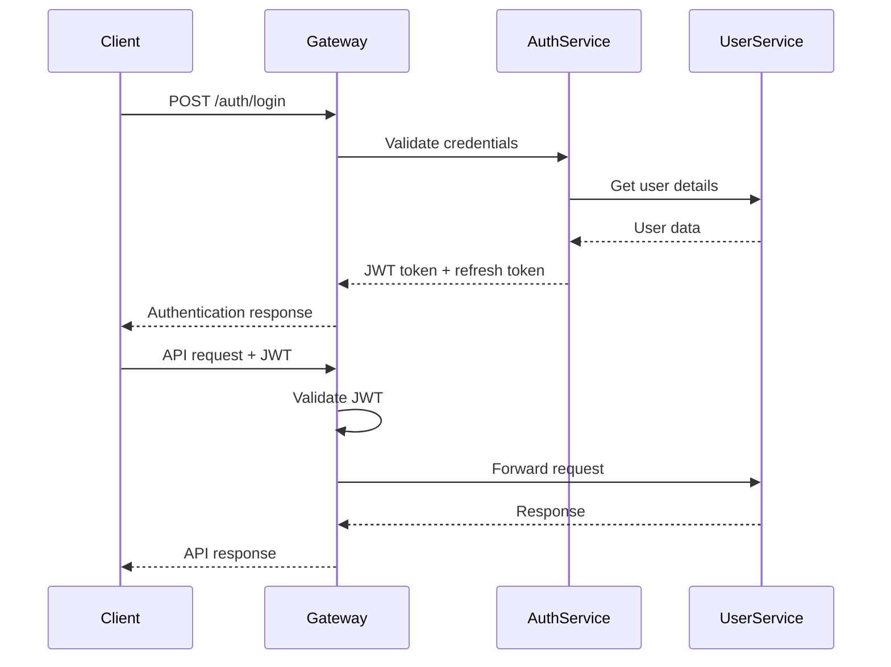

# 5. API Architecture

## 5.1 REST vs GraphQL Strategy

**REST API Usage**:
- CRUD operations (95% of endpoints)
- Real-time data endpoints
- Third-party integrations
- Mobile app APIs

**GraphQL Usage**:
- Complex data aggregation queries
- Admin dashboard analytics
- Course content with nested relationships
- User profile with related data

## 5.2 API Gateway Design

**Kong API Gateway Configuration**:
```yaml
Services:
  - name: user-service
    url: http://user-service:3001
    plugins:
      - rate-limiting: 1000/minute
      - jwt-auth: enabled
      - cors: enabled
      
  - name: signals-service
    url: http://signals-service:3002
    plugins:
      - rate-limiting: 10000/minute (premium users)
      - subscription-check: enabled
      - websocket-proxy: enabled
```

## 5.3 Rate Limiting Strategy

**Tier-based Rate Limits**:
```yaml
Free Users:
  - API calls: 100/hour
  - Signals: 5/day
  - Video streaming: 2 hours/day

Premium Users (₹999-₹2999/month):
  - API calls: 1000/hour
  - Signals: Unlimited
  - Video streaming: Unlimited

Enterprise Users (₹9999/month):
  - API calls: 10000/hour
  - Signals: Real-time + historical
  - Priority support APIs
```

## 5.4 Authentication Flow

**JWT + OAuth2 Flow**:


**Security Features**:
- RS256 JWT signing
- 15-minute access token expiry
- 7-day refresh token rotation
- Device fingerprinting
- Geo-location validation for high-value transactions

---
