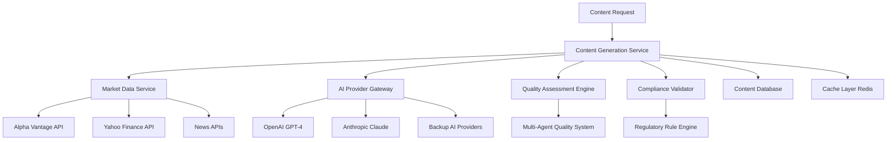

# Epic 002: Content Intelligence Engine

## Epic Overview
**Epic ID**: EPIC-002  
**Epic Name**: Content Intelligence Engine  
**Priority**: P0 (Critical)  
**Estimated Effort**: 21 story points  
**Target Sprint**: Sprint 2-4  

## Business Value
Transform the existing content generation scripts into a scalable, AI-powered content intelligence engine that produces high-quality, compliant financial content at enterprise scale.

## Epic Goals
1. **AI-Powered Generation**: Leverage multiple AI providers for diverse, high-quality content
2. **Quality Assurance**: Automated content scoring and improvement suggestions
3. **Compliance Engine**: Built-in regulatory compliance validation
4. **Real-time Intelligence**: Live market data integration for timely content
5. **Multi-format Support**: Content optimized for different platforms and audiences

## User Stories

### Story 002.1: Market Data Integration
**As a** content creator  
**I want to** access real-time market data in my content generation  
**So that** my content is timely and relevant

**Acceptance Criteria**:
- Real-time stock prices, crypto, forex, commodities data
- Integration with Alpha Vantage, Yahoo Finance APIs
- Data caching for performance (5-minute cache for quotes)
- Historical data access for trend analysis
- Market hours awareness and after-hours data

**Story Points**: 5

### Story 002.2: AI Content Generation Engine
**As a** financial professional  
**I want to** generate high-quality financial content using AI  
**So that** I can create professional content quickly

**Acceptance Criteria**:
- Integration with OpenAI GPT-4 and Anthropic Claude
- 8+ content styles (professional, casual, educational, urgent, etc.)
- Customizable templates for different content types
- Multi-provider fallback for reliability
- Content generation within 30 seconds

**Story Points**: 8

### Story 002.3: Content Quality Scoring System
**As a** content editor  
**I want to** automatically assess content quality  
**So that** only high-quality content reaches my audience

**Acceptance Criteria**:
- Multi-agent quality assessment system (Research, Junior Writer, Senior Writer, Editor, QA)
- Quality scoring on 1-10 scale with 8+ threshold
- Automated improvement suggestions
- Readability analysis and improvement
- Financial accuracy validation

**Story Points**: 5

### Story 002.4: Compliance Validation Engine
**As a** compliance officer  
**I want to** automatically validate content for regulatory compliance  
**So that** we avoid regulatory violations

**Acceptance Criteria**:
- SEC, FINRA, GDPR compliance rule engine
- Automated flagging of problematic content
- Specific violation explanations
- Approval workflow integration
- Compliance reporting and audit trails

**Story Points**: 8

### Story 002.5: News Sentiment Analysis
**As a** market analyst  
**I want to** incorporate news sentiment into content  
**So that** my content reflects current market sentiment

**Acceptance Criteria**:
- Multi-source news aggregation (NewsAPI, RSS feeds)
- Sentiment analysis pipeline using NLP
- Sentiment scoring integration with content generation  
- Trending topic identification
- News source credibility scoring

**Story Points**: 5

### Story 002.6: Content Personalization Engine
**As a** user with specific interests  
**I want to** receive personalized content recommendations  
**So that** the content is relevant to my focus areas

**Acceptance Criteria**:
- User preference profiles (sectors, companies, content types)
- Personalization based on historical engagement
- Industry-specific content customization
- Geographic market focus options
- Learning from user feedback

**Story Points**: 3

### Story 002.7: Multi-Language Content Support
**As a** global financial organization  
**I want to** generate content in multiple languages  
**So that** I can serve international audiences

**Acceptance Criteria**:
- Support for English, Spanish, French, German
- Native content generation (not translation)
- Language-specific financial terminology
- Regional market data integration
- Cultural adaptation for different markets

**Story Points**: 5

### Story 002.8: Content Template Library
**As a** content creator  
**I want to** use pre-built templates for common content types  
**So that** I can generate consistent, professional content quickly

**Acceptance Criteria**:
- 50+ pre-built templates for financial content
- Customizable organization-specific templates
- Template versioning and approval process
- Template performance analytics
- Template sharing between organizations (optional)

**Story Points**: 3

## Technical Requirements

### Architecture Overview


### Service Architecture
**Content Generation Service**:
- **Technology**: Python FastAPI with async/await
- **Processing**: Celery workers for background generation
- **Database**: PostgreSQL for content metadata, Redis for caching
- **APIs**: RESTful endpoints with comprehensive validation

### Database Schema
```sql
-- Content generation requests
CREATE TABLE content_requests (
    id UUID PRIMARY KEY DEFAULT gen_random_uuid(),
    user_id UUID REFERENCES users(id),
    organization_id UUID REFERENCES organizations(id),
    content_type VARCHAR(50) NOT NULL,
    prompt_parameters JSONB,
    status generation_status_enum DEFAULT 'pending',
    created_at TIMESTAMP DEFAULT CURRENT_TIMESTAMP
);

-- Generated content with quality metrics
CREATE TABLE generated_content (
    id UUID PRIMARY KEY DEFAULT gen_random_uuid(),
    request_id UUID REFERENCES content_requests(id),
    title VARCHAR(500),
    body TEXT,
    content_type VARCHAR(50),
    ai_provider VARCHAR(50),
    quality_score DECIMAL(3,2),
    quality_feedback JSONB,
    compliance_status compliance_status_enum,
    compliance_flags JSONB DEFAULT '[]',
    market_data_used JSONB,
    generation_metadata JSONB DEFAULT '{}',
    created_at TIMESTAMP DEFAULT CURRENT_TIMESTAMP
);

-- Content templates
CREATE TABLE content_templates (
    id UUID PRIMARY KEY DEFAULT gen_random_uuid(),
    organization_id UUID REFERENCES organizations(id),
    name VARCHAR(255) NOT NULL,
    description TEXT,
    template_data JSONB,
    is_public BOOLEAN DEFAULT false,
    usage_count INTEGER DEFAULT 0,
    created_by UUID REFERENCES users(id),
    created_at TIMESTAMP DEFAULT CURRENT_TIMESTAMP,
    updated_at TIMESTAMP DEFAULT CURRENT_TIMESTAMP
);
```

### AI Integration Strategy
**Provider Management**:
- **Primary**: OpenAI GPT-4 Turbo for content generation
- **Secondary**: Anthropic Claude for compliance checking
- **Fallback**: Open-source models (Llama 2) for basic tasks
- **Cost Optimization**: Automatic model selection based on complexity

**Quality Assessment Pipeline**:
```python
class ContentQualityPipeline:
    def __init__(self):
        self.research_agent = ResearchAgent()
        self.junior_writer = JuniorWriterAgent() 
        self.senior_writer = SeniorWriterAgent()
        self.editor = EditorAgent()
        self.qa_agent = QualityAssuranceAgent()
    
    async def assess_content(self, content: str, context: dict) -> QualityResult:
        # Multi-agent quality assessment
        research_score = await self.research_agent.validate_facts(content, context)
        writing_score = await self.senior_writer.assess_quality(content)
        editing_score = await self.editor.review_content(content)
        qa_score = await self.qa_agent.final_assessment(content, context)
        
        return QualityResult(
            overall_score=calculate_weighted_score([research_score, writing_score, editing_score, qa_score]),
            recommendations=compile_recommendations([research_score, writing_score, editing_score, qa_score])
        )
```

### Performance Requirements
- **Content Generation**: Complete within 30 seconds for complex requests
- **Quality Assessment**: Complete within 15 seconds
- **Market Data**: Cache for 5 minutes, <1 second retrieval
- **Compliance Check**: Complete within 5 seconds
- **Concurrent Requests**: Support 100 concurrent content generations

### Integration Points
- **Market Data APIs**: Alpha Vantage, Yahoo Finance, NewsAPI
- **AI Providers**: OpenAI, Anthropic, potential open-source models
- **Internal Services**: User Management (authentication), Publishing Service
- **External Services**: Compliance databases, financial news feeds

## Definition of Done
- [ ] All user stories completed with acceptance criteria met
- [ ] Unit tests: 85%+ coverage for content generation logic
- [ ] Integration tests: End-to-end content generation workflows
- [ ] Performance testing: 100 concurrent content generations
- [ ] Quality validation: Generated content achieves 8+ average quality score
- [ ] Compliance testing: All regulatory rules properly enforced
- [ ] Documentation: API docs, integration guides, content templates

## Dependencies
- **Upstream**: Epic 001 (User Management) for authentication
- **Downstream**: Epic 003 (Multi-Platform Publishing) consumes generated content
- **External**: AI provider API access, market data subscriptions

## Risks & Mitigations
- **Risk**: AI provider rate limits or outages
  - **Mitigation**: Multi-provider strategy, intelligent fallback, usage monitoring
- **Risk**: Content quality degradation
  - **Mitigation**: Continuous quality monitoring, A/B testing, human review triggers
- **Risk**: Compliance rule changes
  - **Mitigation**: Modular rule engine, regular legal consultation, version control

## Success Metrics
- **Quality**: 8.5+ average content quality score
- **Performance**: 95% of content generated within 30 seconds
- **Compliance**: Zero regulatory violations from generated content
- **Reliability**: 99.9% service uptime
- **User Satisfaction**: 90%+ user approval rating for generated content
- **Cost Efficiency**: 40% reduction in content creation time vs manual process