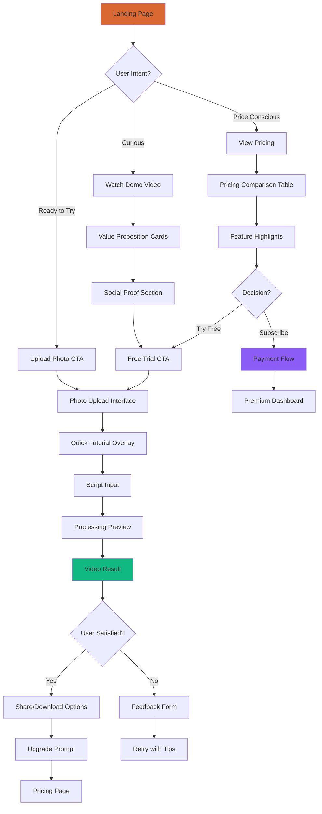
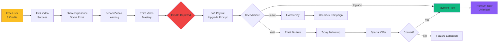
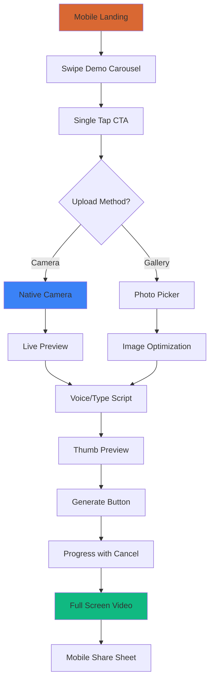
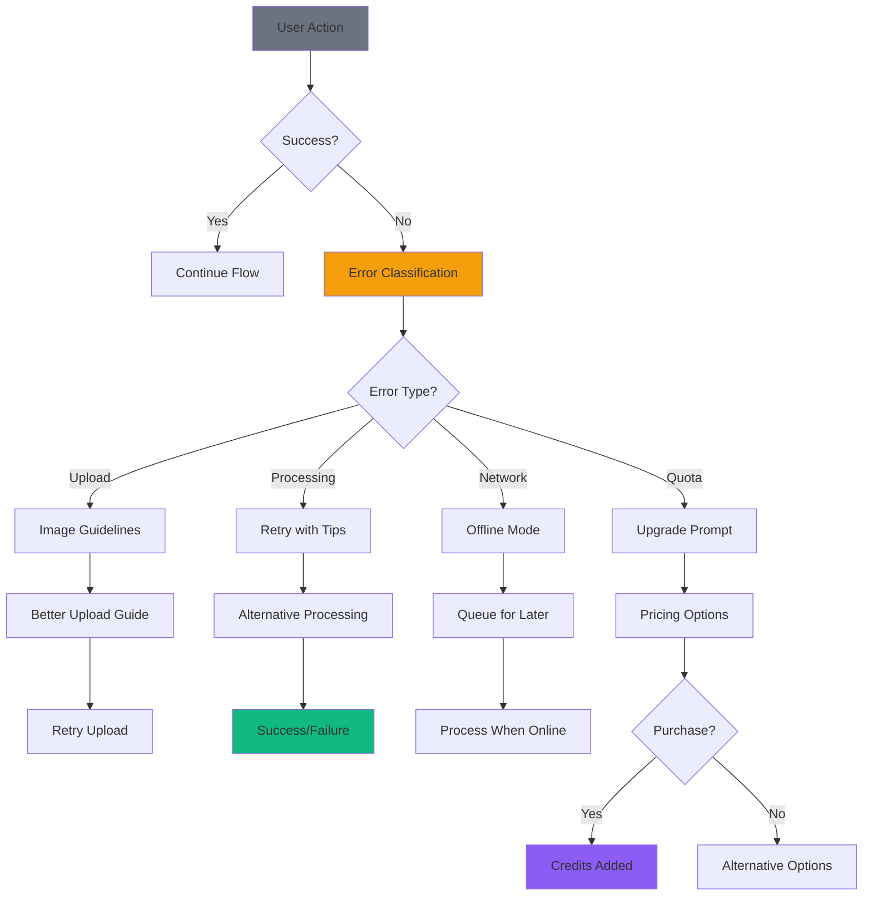

# TalkingPhoto AI - User Flow Diagrams & Wireframes

*Detailed user journey mapping and interface wireframes for conversion optimization*

---

## Core User Flows

### 1. New User Onboarding Flow



### 2. Conversion Funnel - Free to Paid



### 3. Mobile User Journey



### 4. Error Recovery Flow



---

## Wireframe Library

### Landing Page Wireframe

```
┌─────────────────────────────────────────────────────────────────┐
│                    TALKINGPHOTO AI                              │
├─────────────────────────────────────────────────────────────────┤
│                                                                 │
│           🎬 Transform Photos Into Living Stories               │
│                                                                 │
│        AI-powered technology that makes your images speak       │
│              with ultra-realistic voice and expressions         │
│                                                                 │
│                [🚀 Start Creating Magic ✨]                    │
│                                                                 │
│ ┌─────────────────────────────────────────────────────────────┐ │
│ │                 HERO VIDEO PREVIEW                          │ │
│ │              [▶️ Watch 30s Demo]                           │ │
│ │                                                             │ │
│ └─────────────────────────────────────────────────────────────┘ │
│                                                                 │
│              Why Choose TalkingPhoto AI?                       │
│                                                                 │
│ ┌──────────┐    ┌──────────┐    ┌──────────┐                  │
│ │    ⚡    │    │    🎭    │    │    🌍    │                  │
│ │Lightning │    │  Studio  │    │  Multi-  │                  │
│ │   Fast   │    │ Quality  │    │ Language │                  │
│ │          │    │          │    │          │                  │
│ │Generate  │    │Professional-│ │Support   │                  │
│ │in <60s   │    │grade output│ │120+ langs│                  │
│ └──────────┘    └──────────┘    └──────────┘                  │
│                                                                 │
│           ⭐⭐⭐⭐⭐ "Amazing results!" - Sarah K.              │
│           ⭐⭐⭐⭐⭐ "So easy to use!" - Mike T.               │
│           ⭐⭐⭐⭐⭐ "Perfect for marketing" - Lisa M.          │
│                                                                 │
└─────────────────────────────────────────────────────────────────┘
```

### Upload Interface Wireframe

```
┌─────────────────────────────────────────────────────────────────┐
│                   Create Your Talking Photo                     │
├─────────────────────────────────────────────────────────────────┤
│                                                                 │
│               📊 Available Credits: 3 videos remaining         │
│                                                                 │
│ ┌─────────────────────┐    ┌─────────────────────────────────┐  │
│ │   📸 Upload Photo   │    │      📝 Enter Script           │  │
│ │                     │    │                                 │  │
│ │  ┌───────────────┐  │    │  ┌─────────────────────────────┐│  │
│ │  │               │  │    │  │                             ││  │
│ │  │   Drag & Drop │  │    │  │  Enter your script here...  ││  │
│ │  │      or       │  │    │  │                             ││  │
│ │  │   Click Here  │  │    │  │  Keep it conversational     ││  │
│ │  │               │  │    │  │  and under 500 characters   ││  │
│ │  └───────────────┘  │    │  │                             ││  │
│ │                     │    │  └─────────────────────────────┘│  │
│ │  📋 Guidelines:     │    │                                 │  │
│ │  ✅ High-res        │    │  Character count: 0/500         │  │
│ │  ✅ Clear face      │    │  🎤 Voice Input  💡 AI Suggest │  │
│ │  ✅ Good lighting   │    │                                 │  │
│ │  ❌ No sunglasses   │    │  🌐 Language: English ▼        │  │
│ └─────────────────────┘    └─────────────────────────────────┘  │
│                                                                 │
│                  [ Generate Talking Photo 🎬 ]                 │
│                                                                 │
└─────────────────────────────────────────────────────────────────┘
```

### Processing State Wireframe

```
┌─────────────────────────────────────────────────────────────────┐
│                 Creating Your Talking Photo                     │
├─────────────────────────────────────────────────────────────────┤
│                                                                 │
│              ⏱️ Estimated time: 45s remaining                   │
│                                                                 │
│  ████████████████████▓▓▓▓▓▓▓▓▓▓ 67%                           │
│                                                                 │
│  🔄 Generating Voice Synthesis...                              │
│                                                                 │
│  ┌─────────┐ ┌─────────┐ ┌─────────┐ ┌─────────┐ ┌─────────┐  │
│  │   📸    │ │   🔍    │ │   🎤    │ │   🎬    │ │   ✅    │  │
│  │ Process │ │ Analyze │ │Generate │ │ Create  │ │ Ready!  │  │
│  │  Image  │ │  Face   │ │ Voice   │ │ Video   │ │         │  │
│  │    ✓    │ │    ✓    │ │    🔄   │ │         │ │         │  │
│  └─────────┘ └─────────┘ └─────────┘ └─────────┘ └─────────┘  │
│                                                                 │
│                      [⏹️ Cancel]                               │
│                                                                 │
│  💡 Tip: While you wait, check out our template library!      │
│                                                                 │
└─────────────────────────────────────────────────────────────────┘
```

### Video Preview Wireframe

```
┌─────────────────────────────────────────────────────────────────┐
│                    Your Talking Photo is Ready!                │
├─────────────────────────────────────────────────────────────────┤
│                                                                 │
│  ┌─────────────────────────────────────────────────────────┐   │
│  │                                                         │   │
│  │                    [▶️ PLAY VIDEO]                     │   │
│  │                                                         │   │
│  │                   Duration: 0:30                       │   │
│  │                  Quality: 1080p HD                     │   │
│  │                   Format: MP4                          │   │
│  │                                                         │   │
│  └─────────────────────────────────────────────────────────┘   │
│                                                                 │
│               [📥 Download HD]  [🔗 Get Share Link]            │
│                                                                 │
│                      Share Your Creation:                      │
│     [📘 Facebook] [🐦 Twitter] [💼 LinkedIn] [📱 WhatsApp]    │
│                                                                 │
│  ┌─────────────────────────────────────────────────────────┐   │
│  │            🎉 Love your result?                         │   │
│  │                                                         │   │
│  │         Create unlimited videos with Pro!              │   │
│  │                                                         │   │
│  │   • Unlimited video generation                         │   │
│  │   • HD quality downloads                               │   │
│  │   • Commercial usage rights                           │   │
│  │   • Priority processing                                │   │
│  │                                                         │   │
│  │           [🚀 Upgrade to Pro - $29/month]              │   │
│  └─────────────────────────────────────────────────────────┘   │
│                                                                 │
│                Credits remaining: 2 videos                     │
│                                                                 │
└─────────────────────────────────────────────────────────────────┘
```

### Mobile Wireframes

#### Mobile Landing
```
┌─────────────────┐
│  TalkingPhoto   │
├─────────────────┤
│                 │
│   Transform     │
│   Photos Into   │
│   Living        │
│   Stories       │
│                 │
│ AI-powered tech │
│ makes images    │
│ speak with      │
│ realistic voice │
│                 │
│ [Start Free ✨] │
│                 │
│ ┌─────────────┐ │
│ │   Demo      │ │
│ │   Video     │ │
│ │   [▶️]     │ │
│ └─────────────┘ │
│                 │
│ Features:       │
│ ⚡ Fast        │
│ 🎭 Quality     │
│ 🌍 Multi-Lang  │
│                 │
│ ⭐⭐⭐⭐⭐      │
│ "Amazing!" -S.K │
│                 │
└─────────────────┘
```

#### Mobile Upload
```
┌─────────────────┐
│ Create Video    │
├─────────────────┤
│                 │
│ Credits: 3 📊   │
│                 │
│ 📸 Add Photo    │
│ ┌─────────────┐ │
│ │             │ │
│ │   [📷]     │ │
│ │  Camera     │ │
│ │             │ │
│ │   [🖼️]     │ │
│ │  Gallery    │ │
│ │             │ │
│ └─────────────┘ │
│                 │
│ 📝 Your Script  │
│ ┌─────────────┐ │
│ │ Type here.. │ │
│ │             │ │
│ │             │ │
│ │ 🎤   💡     │ │
│ └─────────────┘ │
│ 0/500 chars     │
│                 │
│ [Generate 🎬]   │
│                 │
└─────────────────┘
```

---

## Interaction Patterns

### Hover States & Micro-interactions

```css
/* Card Hover Progression */
.feature-card {
  transition: all 0.4s cubic-bezier(0.25, 0.46, 0.45, 0.94);
}

.feature-card:hover {
  transform: translateY(-8px) scale(1.02);
  box-shadow:
    0 20px 40px rgba(217, 104, 51, 0.3),
    0 0 0 1px rgba(217, 104, 51, 0.1);
}

/* Button Loading States */
.loading-button {
  position: relative;
  overflow: hidden;
}

.loading-button::after {
  content: '';
  position: absolute;
  top: 0;
  left: -100%;
  width: 100%;
  height: 100%;
  background: linear-gradient(
    90deg,
    transparent,
    rgba(255, 255, 255, 0.2),
    transparent
  );
  animation: shimmer 1.5s infinite;
}

@keyframes shimmer {
  100% { left: 100%; }
}

/* Progress Bar Pulse */
.progress-fill {
  background: linear-gradient(
    90deg,
    #d96833 0%,
    #ff7b3d 50%,
    #d96833 100%
  );
  background-size: 200% 100%;
  animation: gradient-shift 2s ease-in-out infinite;
}

@keyframes gradient-shift {
  0%, 100% { background-position: 0% 0%; }
  50% { background-position: 100% 0%; }
}
```

### Form Validation States

```css
/* Input Field States */
.form-input {
  transition: all 0.3s ease;
  border: 2px solid transparent;
}

.form-input:focus {
  border-color: #d96833;
  box-shadow: 0 0 0 3px rgba(217, 104, 51, 0.1);
  outline: none;
}

.form-input.error {
  border-color: #ef4444;
  animation: shake 0.5s ease-in-out;
}

.form-input.success {
  border-color: #10b981;
}

@keyframes shake {
  0%, 100% { transform: translateX(0); }
  25% { transform: translateX(-5px); }
  75% { transform: translateX(5px); }
}

/* Validation Message Animation */
.validation-message {
  max-height: 0;
  overflow: hidden;
  transition: all 0.3s ease;
}

.validation-message.show {
  max-height: 50px;
  margin-top: 8px;
}
```

### Loading Spinner Variations

```css
/* Dots Loading */
.dots-loading {
  display: inline-block;
}

.dots-loading::after {
  content: '';
  animation: dots 1.5s steps(4, end) infinite;
}

@keyframes dots {
  0%, 20% { content: '.'; }
  40% { content: '..'; }
  60% { content: '...'; }
  90%, 100% { content: ''; }
}

/* Circular Progress */
.circular-progress {
  width: 50px;
  height: 50px;
  border-radius: 50%;
  background: conic-gradient(
    from 0deg,
    #d96833 0deg,
    #d96833 calc(var(--progress) * 3.6deg),
    rgba(217, 104, 51, 0.2) calc(var(--progress) * 3.6deg),
    rgba(217, 104, 51, 0.2) 360deg
  );
}

/* Pulse Animation */
.pulse-loader {
  animation: pulse 1.5s ease-in-out infinite;
}

@keyframes pulse {
  0% {
    transform: scale(1);
    opacity: 1;
  }
  50% {
    transform: scale(1.1);
    opacity: 0.7;
  }
  100% {
    transform: scale(1);
    opacity: 1;
  }
}
```

---

## Responsive Breakpoint Behaviors

### Mobile Portrait (320px - 480px)
```css
@media (max-width: 480px) {
  .hero-title {
    font-size: 2rem;
    line-height: 1.2;
  }

  .feature-grid {
    display: block;
  }

  .feature-card {
    margin-bottom: 1rem;
    padding: 1.5rem;
  }

  .upload-zone {
    min-height: 200px;
  }

  .mobile-only {
    display: block;
  }

  .desktop-only {
    display: none;
  }
}
```

### Tablet Portrait (768px - 1024px)
```css
@media (min-width: 768px) and (max-width: 1024px) {
  .container {
    max-width: 720px;
    padding: 0 2rem;
  }

  .feature-grid {
    grid-template-columns: repeat(2, 1fr);
    gap: 1.5rem;
  }

  .upload-section {
    grid-template-columns: 1fr;
  }

  .hero-title {
    font-size: 3rem;
  }
}
```

### Desktop (1024px+)
```css
@media (min-width: 1024px) {
  .container {
    max-width: 1200px;
    padding: 0 3rem;
  }

  .feature-grid {
    grid-template-columns: repeat(3, 1fr);
    gap: 2rem;
  }

  .upload-section {
    grid-template-columns: 1fr 1fr;
  }

  .hero-title {
    font-size: 4rem;
  }

  .desktop-only {
    display: block;
  }

  .mobile-only {
    display: none;
  }
}
```

---

## Conversion Optimization Elements

### Social Proof Placement
```
Landing Page Sections:
1. Hero + Demo Video (Above fold)
2. Feature Benefits (Credibility)
3. Customer Testimonials (Social proof)
4. Usage Statistics (Authority)
5. Pricing (Clear value)
6. FAQ (Objection handling)
7. Final CTA (Urgency)
```

### Trust Signal Integration
```html
<!-- Security Badges -->
<div class="trust-signals">
  
  
  <span>🔒 Your data is safe with us</span>
</div>

<!-- Usage Statistics -->
<div class="usage-stats">
  <div class="stat">
    <span class="number">50K+</span>
    <span class="label">Videos Created</span>
  </div>
  <div class="stat">
    <span class="number">98%</span>
    <span class="label">Happy Customers</span>
  </div>
  <div class="stat">
    <span class="number">24/7</span>
    <span class="label">Support</span>
  </div>
</div>

<!-- Customer Logos -->
<div class="customer-logos">
  <span class="label">Trusted by teams at:</span>
  
  
  
</div>
```

### A/B Testing Framework
```python
# A/B test configurations
AB_TESTS = {
    "hero_cta": {
        "variants": [
            "Start Creating Magic ✨",
            "Try Free Now 🚀",
            "Create Your First Video"
        ]
    },
    "pricing_display": {
        "variants": ["monthly_first", "annual_first"]
    },
    "social_proof": {
        "variants": ["testimonials", "statistics", "both"]
    }
}

def get_variant(test_name, user_id):
    """Get A/B test variant for user"""
    import hashlib
    hash_input = f"{test_name}_{user_id}"
    hash_value = int(hashlib.md5(hash_input.encode()).hexdigest(), 16)
    variant_count = len(AB_TESTS[test_name]["variants"])
    return AB_TESTS[test_name]["variants"][hash_value % variant_count]
```

---

*This comprehensive wireframe and flow documentation ensures optimal user experience design that maximizes conversion while maintaining intuitive navigation patterns across all device types.*